# ✅ Arduino Starter Kit Numbered Checklist
---

## ແຜ່ນວົງຈອນຫຼັກ ແລະ ການໂຕ້ຕອບ (Core Boards & Interfaces)

+ Arduino Uno baord : ແມ່ນແຜງໄມໂຄຣຄອນໂທນເລີ (Microcontroller Board) ແບບ open-source ທີ່ສ້າງຂຶ້ນເທິງຊິບ **ATmega328P**.
- ໜ້າທີ່ການໃຊ້ງານ : ເຮັດໜ້າທີ່ເປັນ "ສະໝອງ" ຂອງໂຄງການຂອງທ່ານ, ໄດ້ຮັບຄ່າປ້ອນເຂົ້າ ແລະ ຄວບຄຸມຄ່າອອກ (ເຊັນເຊີ, ມໍເຕີ, ໜ້າຈໍສະແດງຜົນ, ແລະ ອື່ນໆ).
- ຕົວຢ່າງການນຳໃຊ້ : ການເຮັດໃຫ້ດອກໄຟ LED ກະພິບ ເພື່ອສະແດງໃຫ້ເຫັນການຄວບຄຸມ digital output ແບບງ່າຍດາຍ.
  
ຮູບພາບ : 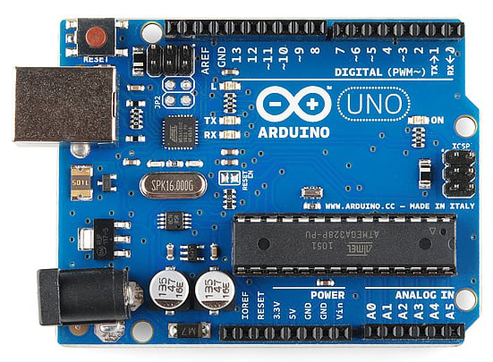
PINOUT Guide : 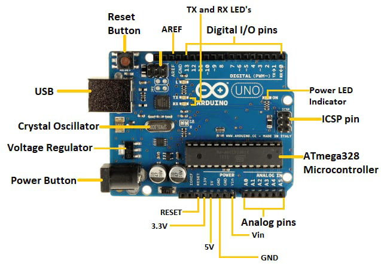

- Breadboards : ແມ່ນແຜງພລາສຕິກທີ່ມີຮູ, ໃຊ້ສຳລັບການສ້າງແບບຈຳລອງ (prototype) ວົງຈອນເອເລັກໂຕຣນິກຊົ່ວຄາວ. ມັນຊ່ວຍໃຫ້ສາມາດເຊື່ອມຕໍ່ອຸປະກອນຕ່າງໆໄດ້ໂດຍບໍ່ຈຳເປັນຕ້ອງມີການເຊື່ອມ.
-  **ໜ້າທີ່ການໃຊ້ງານ** : ໂຄງສ້າງພາຍໃນຂອງເບຣດບອດປະກອບດ້ວຍແຜ່ນໂລຫະທີ່ເປັນຕົວນຳໄຟຟ້າຊຶ່ງຖືກເຊື່ອງຢູ່ໃຕ້ຮູສຽບພລາສຕິກ. ເມື່ອສຽບຂາຂອງອົງປະກອບເອເລັກໂຕຣນິກ ຫຼື ສາຍໄຟລົງໄປ, ແຜ່ນໂລຫະນີ້ຈະຈັບຂາອຸປະກອນໄວ້ ແລະ ສ້າງການເຊື່ອມຕໍ່ທາງໄຟຟ້າ.
- ຕົວຢ່າງການນຳໃຊ້ : ການເຊື່ອມຕໍ່ແຫຼ່ງຈ່າຍໄຟຈາກ Arduino.
ຮູບພາບ : 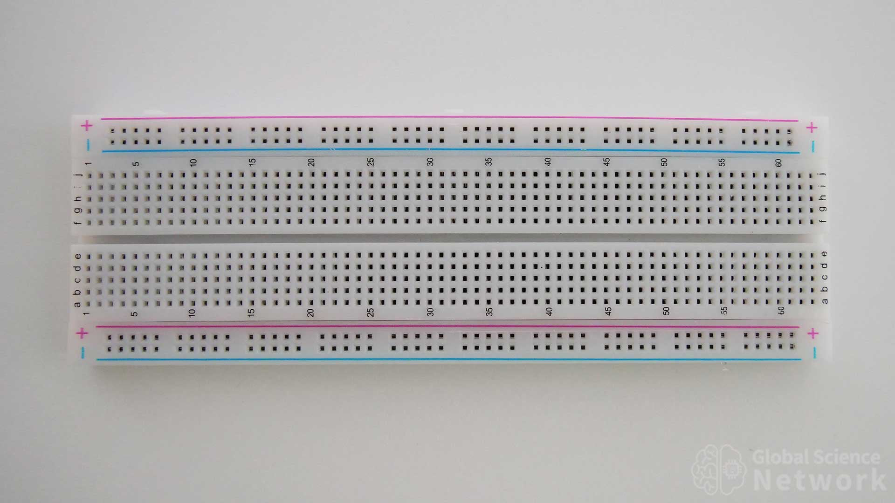
PINOUT Guide : 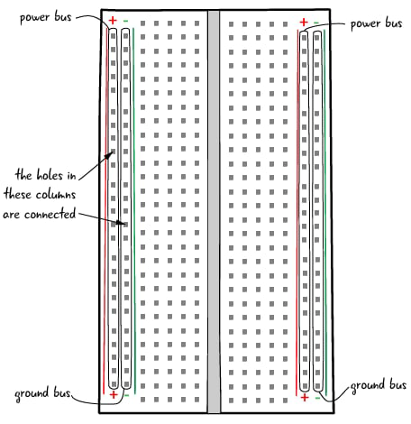

- USB cable : ເປັນສາຍມາດຕະຖານສຳລັບການສື່ສານຂໍ້ມູນ ແລະ ການສະໜອງພະລັງງານລະຫວ່າງຄອມພິວເຕີ ແລະ ອຸປະກອນເອເລັກໂຕຣນິກ. ສຳລັບ Arduino Uno, ສາຍທີ່ໃຊ້ແມ່ນປະເພດ USB Type-A to Type-B.
- **ໜ້າທີ່ການໃຊ້ງານ** : ສາຍ USB ເຮັດສອງໜ້າທີ່ຫຼັກຄື: * **ພະລັງງານ (Power):** ມັນສະໜອງພະລັງງານ 5V ໃຫ້ກັບ Arduino Uno ຈາກຄອມພິວເຕີ. * **ຂໍ້ມູນ (Data):** ມັນສ້າງຊ່ອງທາງການສື່ສານແບບ serial ເພື່ອອັບໂຫລດລະຫັດຈາກຄອມພິວເຕີໄປຫາ Arduino ແລະ ສົ່ງຂໍ້ມູນ serial ກັບຄືນໄປຫາຄອມພິວເຕີ (Serial Monitor).
- ຕົວຢ່າງການນຳໃຊ້ : ການຂຽນໂປຣແກຣມໃຫ້ Arduino.
ຮູບພາບ : 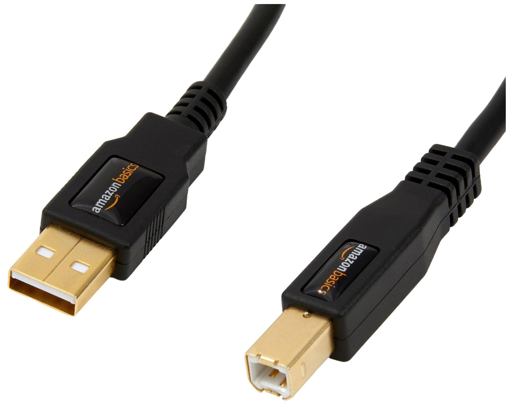
PINOUT Guide : 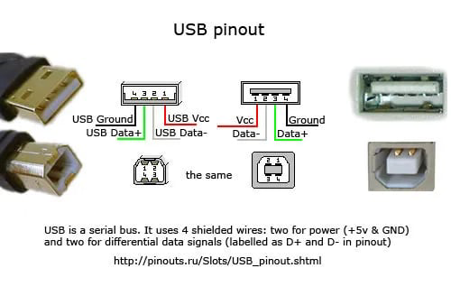

---

## ສາຍໄຟ ແລະ ຕົວເຊື່ອມຕໍ່ (Wiring & Connectors)

- Jumper wires (male-to-male) : ສາຍເຊື່ອມຕໍ່ແບບຊາຍ-ຊາຍ (Male-to-Male) ຄືສາຍໄຟທີ່ມີຫົວສຽບແບບເຂັມ (pin) ຢູ່ທັງສອງສົ້ນ. ມັນຖືກນຳໃຊ້ເພື່ອສ້າງການເຊື່ອມຕໍ່ຊົ່ວຄາວລະຫວ່າງຈຸດຕ່າງໆເທິງແຜງທົດລອງ.
- **ໜ້າທີ່ການໃຊ້ງານ** : ຫົວເຂັມຖືກອອກແບບມາໃຫ້ພໍດີກັບຮູສຽບຂະໜາດ 0.1 ນິ້ວ (2.54mm) ຂອງແຜງທົດລອງ, ເຊິ່ງສ້າງການເຊື່ອມຕໍ່ທີ່ໝັ້ນຄົງແຕ່ສາມາດຖອດອອກໄດ້ງ່າຍ.
- ຕົວຢ່າງການນຳໃຊ້ : **ການເຊື່ອມຕໍ່ GND ແລະ 5V ຂອງ Arduino ໄປຫາລາງພະລັງງານຂອງ Breadboard**.
ຮູບພາບ : 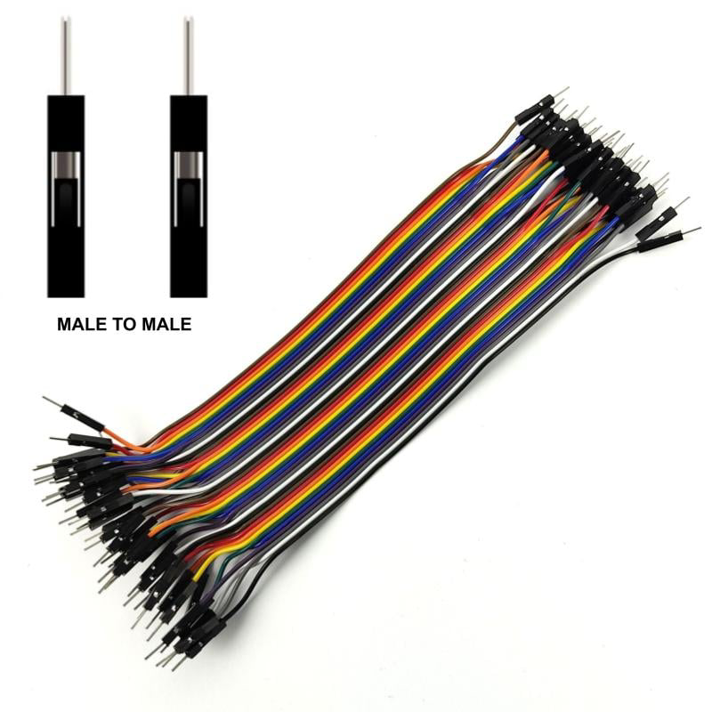

- Jumper wire (male-to-female) : ຄືສາຍໄຟທີ່ມີຫົວເຂັມຢູ່ສົ້ນໜຶ່ງ ແລະ ຫົວສຽບແບບຮູ (socket) ຢູ່ອີກສົ້ນໜຶ່ງ.
- **ໜ້າທີ່ການໃຊ້ງານ** : ຫົວເຂັມຈະຖືກສຽບເຂົ້າໄປໃນແຜງທົດລອງ, ແລະ ຫົວຮູຈະຖືກສວມໃສ່ຫົວເຂັມຂອງອຸປະກອນອື່ນ, ເຊິ່ງເປັນວິທີທີ່ນິຍົມໃຊ້ທີ່ສຸດໃນການເຊື່ອມຕໍ່ລະຫວ່າງແຜງ Arduino ກັບວົງຈອນເທິງແຜງທົດລອງ.
- ຕົວຢ່າງການນຳໃຊ້ : **ການເຊື່ອມຕໍ່ເຊັນເຊີ DHT11 (ມີ Pin Header) ໄປຫາ Arduino Uno**.
ຮູບພາບ : 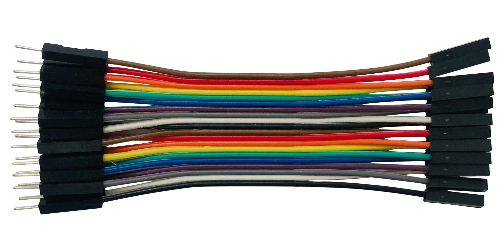

- Jumper wire (female-to-female) : ຄືສາຍໄຟທີ່ມີຫົວສຽບແບບຮູຢູ່ທັງສອງສົ້ນ. ມັນຖືກໃຊ້ເພື່ອເຊື່ອມຕໍ່ອົງປະກອບສອງຢ່າງທີ່ຕ່າງກໍມີຫົວຕໍ່ແບບເຂັມ, ເຊັ່ນ ການເຊື່ອມຕໍ່ລະຫວ່າງໂມດູນເຊັນເຊີກັບໂມດູນອື່ນໆໂດຍກົງ.
- **ໜ້າທີ່ການໃຊ້ງານ** : ພວກມັນຖືກໃຊ້ໂດຍສະເພາະສຳລັບການເຊື່ອມຕໍ່: * **Pin Headers ຂອງ Module ຫາ Pin Headers ຂອງ Module:** ເຊັ່ນ: ເຊື່ອມຕໍ່ Pin ຂອງເຊັນເຊີໂດຍກົງກັບ Pin ຂອງ Arduino (ໂດຍບໍ່ຜ່ານ breadboard).
- ຕົວຢ່າງການນຳໃຊ້ : **ການເຊື່ອມຕໍ່ເຊັນເຊີ Ultrasonic (HC-SR04) ກັບ Arduino**.
ຮູບພາບ : 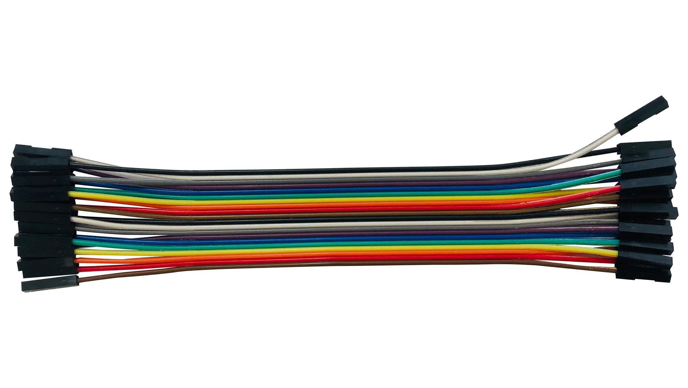

- 9V Battery Connector : ອົງປະກອບນີ້ແມ່ນສາຍອະແດັບເຕີ. ສົ້ນໜຶ່ງເປັນຫົວຕໍ່ແບບກິບສຳລັບຕິດໃສ່ກັບຖ່ານ (ແບັດເຕີຣີ) 9V ມາດຕະຖານ, ແລະ ອີກສົ້ນໜຶ່ງເປັນຫົວສຽບໄຟ DC (DC barrel plug) ຂະໜາດ 5.5x2.1mm ທີ່ພໍດີກັບຊ່ອງສຽບໄຟຂອງ Arduino Uno.
- ໜ້າທີ່ການໃຊ້ງານ : ມັນສາມາດໃຫ້ Arduino Uno ໄດ້ຮັບພະລັງງານຈາກແບັດເຕີຣີ 9V, ເຮັດໃຫ້ໂຄງການສາມາດໃຊ້ງານໄດ້ໂດຍບໍ່ຈຳເປັນຕ້ອງເຊື່ອມຕໍ່ກັບຄອມພິວເຕີ ຫຼື ແຫຼ່ງພະລັງງານອື່ນໆ.
- ຕົວຢ່າງການນຳໃຊ້ : **ການໃຫ້ພະລັງງານແກ່ໂຄງການທີ່ໃຊ້ງານຢູ່ (Standalone Project Power Supply)**.
ຮູບພາບ : 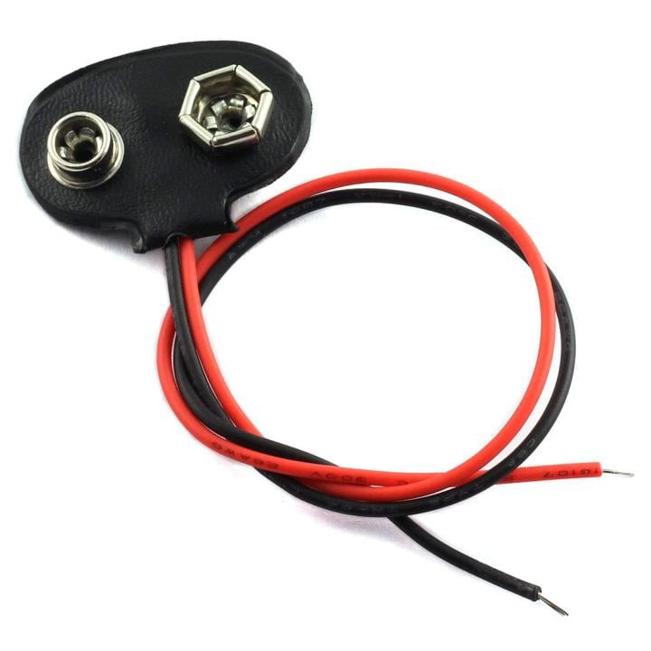

---

## ອົງປະກອບພື້ນຖານ (Basic Components)

- LEDs : ແມ່ນອຸປະກອນ semiconductor ທີ່ປ່ອຍແສງສະຫວ່າງອອກມາເມື່ອກະແສໄຟຟ້າໄຫຼຜ່ານມັນ. ມັນມີປະສິດທິພາບສູງກວ່າຫຼອດໄຟແບບໄສ້ເຖິງ 90% ແລະ ມີອາຍຸການໃຊ້ງານທີ່ຍາວນານກວ່າ. LED ມີສອງຂາຄື: ຂາບວກ (Anode) ເຊິ່ງປົກກະຕິຈະຍາວກວ່າ, ແລະ ຂາລົບ (Cathode) ເຊິ່ງຈະສັ້ນກວ່າ.
- ໜ້າທີ່ການໃຊ້ງານ : LED ເຮັດວຽກເປັນໄດໂອດ; ໄຟຟ້າຕ້ອງໄຫຼຈາກຂາ **Anode (+) ຫາ Cathode (-)**. ພວກມັນປ່ອຍແສງເປັນສີທີ່ແຕກຕ່າງກັນຕາມວັດສະດຸ semiconductor ທີ່ໃຊ້. LED RGB ມີສີ່ຂາ, ແຕ່ລະຂາສຳລັບສີແດງ, ສີຂຽວ, ສີຟ້າ, ແລະ ຂາທົ່ວໄປ (common).
- ຕົວຢ່າງການນຳໃຊ້ : **ຄວບຄຸມ LED ດ້ວຍ Arduino**.
ຮູບພາບ : 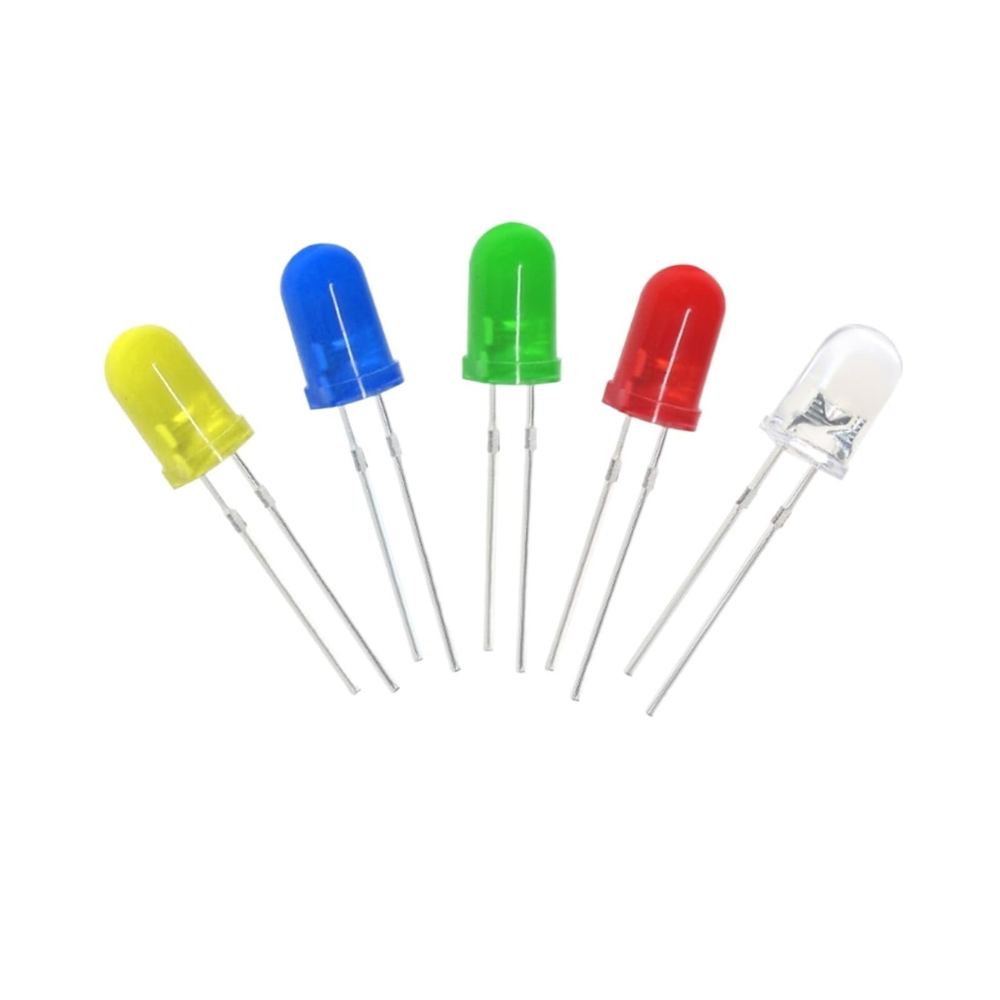
PINOUT Guide : 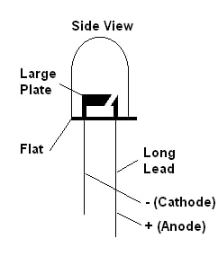

- RGB nodule : ແມ່ນໂມດູນທີ່ບັນຈຸ LED RGB, ເຊິ່ງສາມາດຜະລິດແສງສີຕ່າງໆໄດ້ໂດຍການປະສົມຄວາມເຂັ້ມຂອງສີແດງ (Red), ສີຂຽວ (Green), ແລະ ສີຟ້າ (Blue). ມັນມີຕົວຕ້ານທານທີ່ຈຳກັດກະແສໄຟຟ້າໃນຕົວ.
- ໜ້າທີ່ການໃຊ້ງານ : ການຄວບຄຸມສີຂອງໂມດູນ RGB ເຮັດໄດ້ໂດຍການໃຊ້ສັນຍານ PWM (Pulse Width Modulation) ຈາກ Arduino ເພື່ອຄວບຄຸມຄວາມສະຫວ່າງຂອງ LED ແຕ່ລະສີ. ໂດຍການປັບຄ່າ duty cycle ຂອງສັນຍານ PWM (ຄ່າລະຫວ່າງ 0-255), ເຮົາສາມາດປັບຄວາມເຂັ້ມຂອງແສງສີແດງ, ຂຽວ, ແລະ ຟ້າ ໄດ້ຢ່າງອິດສະຫຼະ ເພື່ອສ້າງສີທີ່ຕ້ອງການ.
- ຕົວຢ່າງການນຳໃຊ້ : ການສ້າງສີຕ່າງໆດ້ວຍໂມດູນ RGB.
ຮູບພາບ : 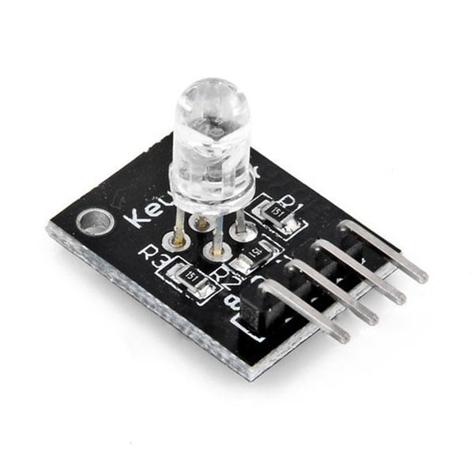

PINOUT Guide : 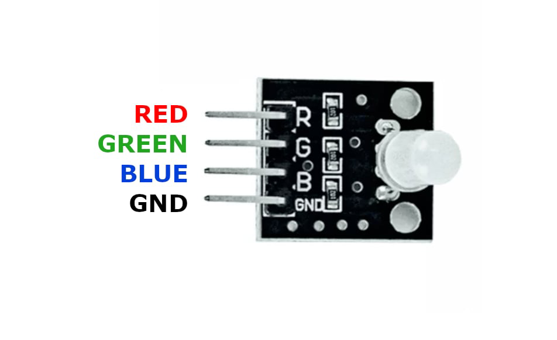

- Resistor : ຕົວຕ້ານທານ (Resistor) ເປັນອົງປະກອບເອເລັກໂຕຣນິກແບບ passive ທີ່ມີສອງຂົ້ວ ເຊິ່ງມີໜ້າທີ່ຫຼັກໃນການຕ້ານ ຫຼື ຈຳກັດການໄຫຼຂອງກະແສໄຟຟ້າໃນວົງຈອນ.45 ຄ່າຄວາມຕ້ານທານຈະຖືກວັດແທກເປັນໜ່ວຍ ໂອມ (Ohm), ສັນຍາລັກ $Ω$. ຄ່າຄວາມຕ້ານທານຂອງຕົວຕ້ານທານສ່ວນໃຫຍ່ສາມາດອ່ານໄດ້ຈາກແຖບສີທີ່ພິມຢູ່ເທິງຕົວຂອງມັນ.
- ໜ້າທີ່ການໃຊ້ງານ : ພວກມັນຖືກໃຊ້ສຳລັບການຈຳກັດກະແສໄຟຟ້າ (ເຊັ່ນ: 220Ω ຖືກໃຊ້ກັບ LED ເພື່ອປ້ອງກັນບໍ່ໃຫ້ມັນໄໝ້).
- ຕົວຢ່າງການນຳໃຊ້ : **ການໃຊ້ Resistor 10kΩ ເປັນ Pull-down ກັບ Push Button**.
ຮູບພາບ : 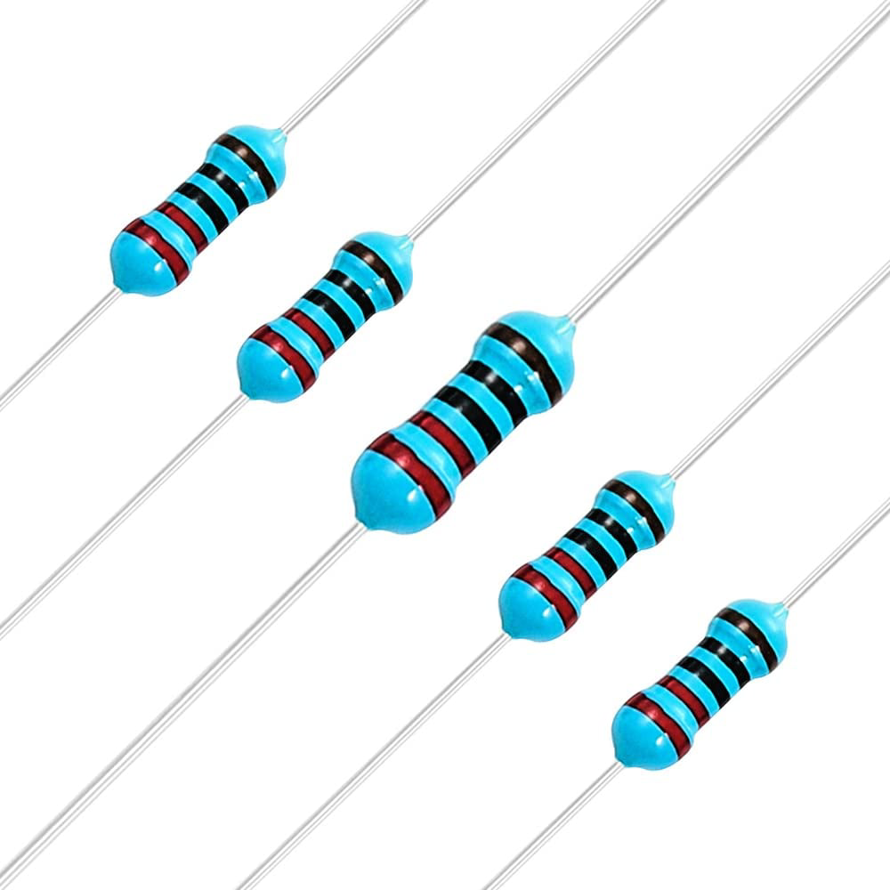
PINOUT Guide : 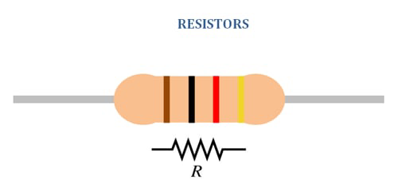

- Push Buttons :ແມ່ນສະວິດຊົ່ວຄາວທີ່ປິດ ຫຼື ເປີດວົງຈອນໃນຂະນະທີ່ມັນຖືກກົດ ແລະ ກັບຄືນສູ່ສະຖານະເດີມເມື່ອຖືກປ່ອຍ.
- ໜ້າທີ່ການໃຊ້ງານ : ມັນເຮັດວຽກໂດຍການປ່ຽນແປງສະຖານະຂອງການປ້ອນຂໍ້ມູນດິຈິຕອລຂອງ Arduino. ໂດຍປົກກະຕິແລ້ວມັນຈະຖືກໃຊ້ໃນການເຊື່ອມຕໍ່ແບບ **Pull-down** (ໃຫ້ຄ່າ LOW ເມື່ອບໍ່ຖືກກົດ) ຫຼື **Pull-up** (ໃຫ້ຄ່າ HIGH ເມື່ອບໍ່ຖືກກົດ).
- **ຕົວຢ່າງການນໍາໃຊ້ : ເປີດ-ປິດ LED ດ້ວຍປຸ່ມກົດ**.
ຮູບພາບ : 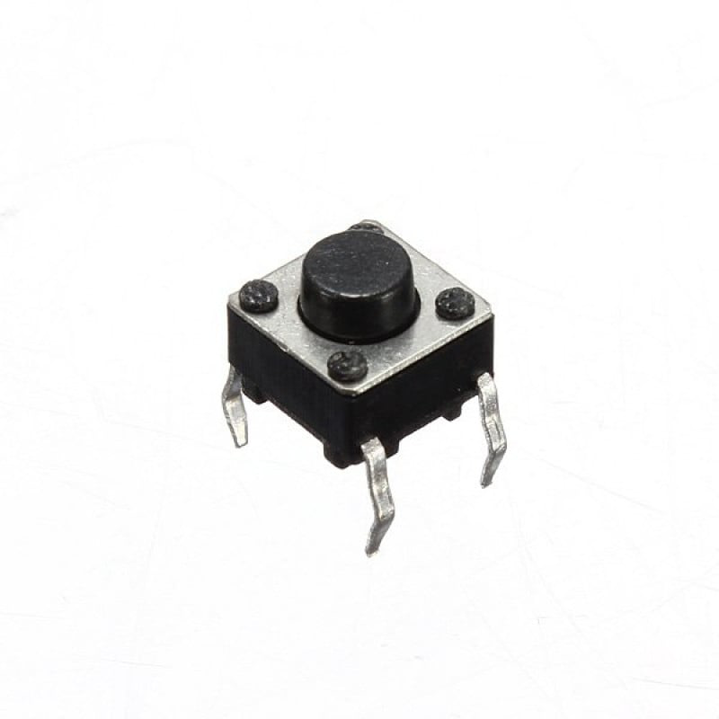
PINOUT Guide : 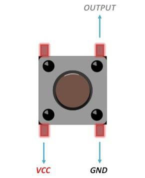

- Potentiometer : ແມ່ນຕົວຕ້ານທານທີ່ປັບໄດ້ສາມຂາ, ໂດຍປົກກະຕິແລ້ວແມ່ນ 5kΩ. ມັນຖືກໃຊ້ເພື່ອຄວບຄຸມຄ່າຄວາມຕ້ານທານແບບປັບໄດ້ ຫຼື ເປັນຕົວແບ່ງໂວນທີ່ປັບໄດ້.
- ໜ້າທີ່ການໃຊ້ງານ : ເຮັດວຽກໂດຍມີແຖບວັດສະດຸທີ່ມີຄວາມຕ້ານທານຢູ່ພາຍໃນ. ຂາຂ້າງທັງສອງຈະເຊື່ອມຕໍ່ກັບສົ້ນທັງສອງຂອງແຖບນີ້, ເຮັດໃຫ້ມີຄ່າຄວາມຕ້ານທານຄົງທີ່ລະຫວ່າງກັນ (ໃນກໍລະນີນີ້ຄື 5kΩ). ຂາກາງ (wiper) ເປັນຕົວສຳຜັດທີ່ສາມາດເລື່ອນໄປຕາມແຖບຄວາມຕ້ານທານ. ເມື່ອໝຸນແກນ, ຕຳແໜ່ງຂອງ wiper ຈະປ່ຽນໄປ, ເຮັດໃຫ້ຄ່າຄວາມຕ້ານທານລະຫວ່າງຂາກາງກັບຂາຂ້າງແຕ່ລະຂ້າງປ່ຽນແປງ. ເມື່ອເຊື່ອມຕໍ່ຂາຂ້າງທັງສອງກັບ 5V ແລະ GND, ແຮງດັນທີ່ຂາກາງຈະປ່ຽນແປງຢ່າງຕໍ່ເນື່ອງຈາກ 0V ຫາ 5V, ເຊິ່ງສາມາດອ່ານຄ່າໄດ້ດ້ວຍຂາອະນາລັອກຂອງ Arduino.
- ຕົວຢ່າງການນຳໃຊ້ : **ຄວບຄຸມຄວາມສະຫວ່າງຂອງ LED**.
ຮູບພາບ : 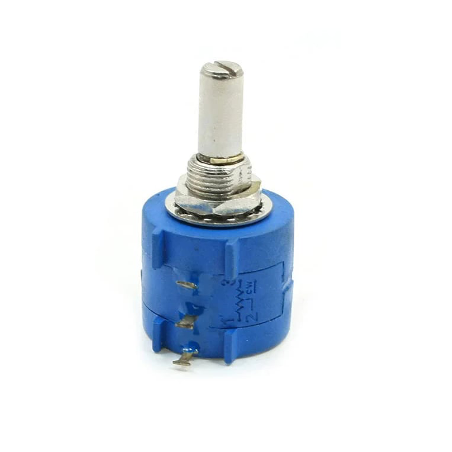
PINOUT Guide : 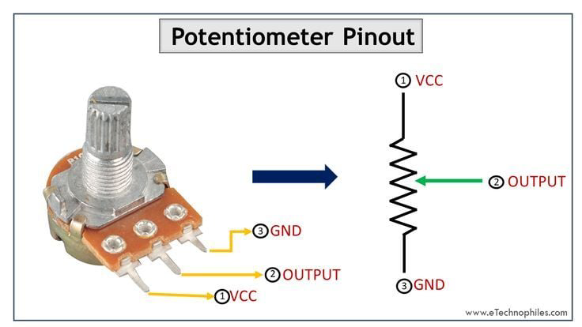

- Active Buzzer : ແມ່ນລຳໂພງ piezoelectric ຂະໜາດນ້ອຍທີ່ມີວົງຈອນກຳເນີດສຽງ (oscillator) ໃນຕົວ.
- ໜ້າທີ່ການໃຊ້ງານ : ມັນຜະລິດສຽງ (tone) ທີ່ຄວາມຖີ່ຄົງທີ່ເມື່ອໄດ້ຮັບໂວນ DC ທີ່ຖືກຕ້ອງ (ເຊັ່ນ: 5V). ມັນງ່າຍຕໍ່ການໃຊ້ງານ, ເພາະມັນພຽງແຕ່ຕ້ອງການສັນຍານ HIGH/LOW ຈາກ Arduino ເພື່ອເປີດ/ປິດສຽງ.
- ຕົວຢ່າງການນຳໃຊ້ : **ການສ້າງສຽງເຕືອນ**.

ຮູບພາບ : 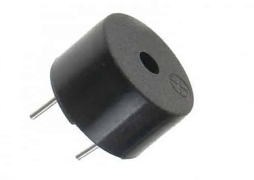

- Passive Buzzer : ແມ່ນລຳໂພງ piezoelectric ຂະໜາດນ້ອຍທີ່ບໍ່ມີວົງຈອນກຳເນີດສຽງໃນຕົວ. ມັນຕ້ອງການສັນຍານຄື້ນສີ່ຫຼ່ຽມ (square wave) ຈາກພາຍນອກເພື່ອສ້າງສຽງ.
- ໜ້າທີ່ການໃຊ້ງານ : Arduino ຕ້ອງໃຊ້ຟັງຊັນ **`tone()`** ເພື່ອສົ່ງສັນຍານຄື້ນສີ່ຫຼ່ຽມທີ່ຄວາມຖີ່ທີ່ແຕກຕ່າງກັນໄປຫາ Passive Buzzer. ນີ້ອະນຸຍາດໃຫ້ມັນສາມາດຜະລິດສຽງ (tones) ທີ່ຫຼາກຫຼາຍ ແລະ ສາມາດຫຼິ້ນເພງໄດ້.
- ຕົວຢ່າງການນຳໃຊ້ : **ການສ້າງທຳນອງເພງງ່າຍໆ**.
ຮູບພາບ : 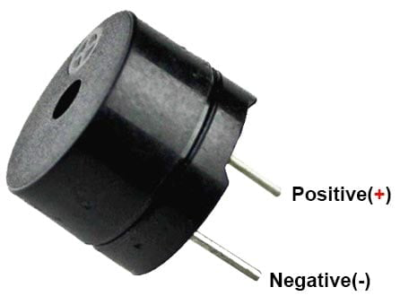

---

## ໜ້າຈໍສະແດງຜົນ ແລະ ຜົນອອກ (Displays & Output)

- 16x2 LCD Display : ແມ່ນຈໍສະແດງຜົນຂໍ້ຄວາມທີ່ສາມາດສະແດງຕົວອັກສອນໄດ້ 16 ຕົວອັກສອນໃນ 2 ແຖວ.
- ໜ້າທີ່ການໃຊ້ງານ : ສະແດງຂໍ້ຄວາມ ຫຼື ຕົວເລກສຳລັບຜົນອອກຂອງຜູ້ໃຊ້ໃນໂຄງການຕ່າງໆ
- ຕົວຢ່າງການນຳໃຊ້ : **ສະແດງຂໍ້ຄວາມ "Hello, World!"**.
ຮູບພາບ : 

- 12C Serial Adapter board moudule : ແມ່ນໂມດູນທີ່ຕິດຕັ້ງຢູ່ດ້ານຫຼັງຂອງ 16x2 LCD ເພື່ອແປງການສື່ສານແບບ Parallel ຂອງ LCD ໃຫ້ເປັນການສື່ສານແບບ I2C Serial.
- ໜ້າທີ່ການໃຊ້ງານ : ມັນໃຊ້ໂປຣໂຕຄໍ I2C, ເຊິ່ງຕ້ອງການພຽງແຕ່ **ສອງສາຍ** (SDA - Data ແລະ SCL - Clock) ບວກກັບ VCC ແລະ GND, ເພື່ອຄວບຄຸມ LCD. ນີ້ຊ່ວຍປະຢັດ Pin ດິຈິຕອລສ່ວນໃຫຍ່ຂອງ Arduino ໄວ້ສຳລັບການໃຊ້ງານອື່ນ.
- ຕົວຢ່າງການນຳໃຊ້ : **ຄວບຄຸມຈໍ LCD ຜ່ານ I2C**.
ຮູບພາບ : 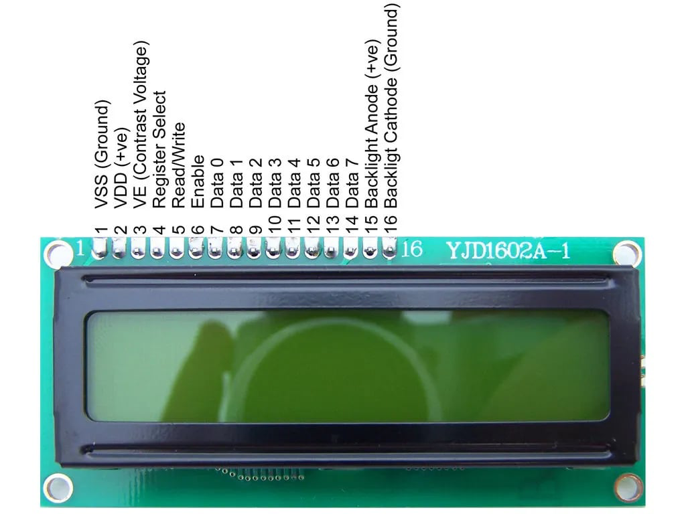

PINOUT Guide : 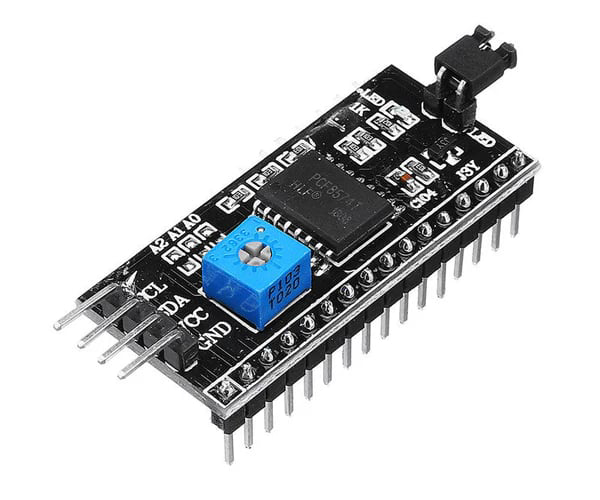

- 7-segment display : ແມ່ນຮູບແບບການສະແດງຜົນເອເລັກໂຕຣນິກທີ່ໃຊ້ LED ເຈັດອັນ (ເຊັ່ນ: ແຕ່ລະອັນເປັນ "segment") ເພື່ອສະແດງຕົວເລກ 0 ຫາ 9. ຊຸດປະກອບມີແບບ **Common Cathode**.
- ໜ້າທີ່ການໃຊ້ງານ : ສຳລັບປະເພດ Common Cathode, ຂາຮ່ວມ (COM) ຈະຖືກເຊື່ອມຕໍ່ກັບ GND. ເພື່ອເຮັດໃຫ້ສ່ວນໃດໜຶ່ງສະຫວ່າງ, ເຮົາຕ້ອງສົ່ງສັນຍານ HIGH (5V) ໄປຍັງຂາຂອງສ່ວນນັ້ນ. ແຕ່ລະສ່ວນຈະຖືກຕັ້ງຊື່ເປັນ a, b, c, d, e, f, ແລະ g. ຕົວຢ່າງ, ເພື່ອສະແດງເລກ "1", ເຮົາຈະຕ້ອງເປີດສ່ວນ b ແລະ c.
- ຕົວຢ່າງການນຳໃຊ້ : **ການສະແດງເຄື່ອງນັບເລກແບບງ່າຍດາຍ**.
ຮູບພາບ :        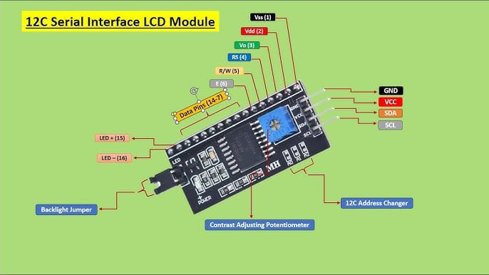
PINOUT Guide : 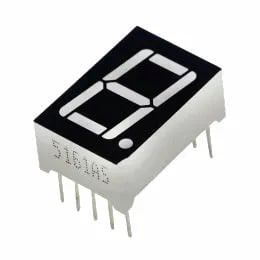

- 4-Digit 7-Segment Display : ແມ່ນການລວມຂອງ 7-segment display ສີ່ອັນເຂົ້າກັນເພື່ອສະແດງຕົວເລກສີ່ໂຕ.
- ໜ້າທີ່ການໃຊ້ງານ : ການສະແດງຜົນເທິງຈໍ 4-ຕົວເລກ ໃຊ້ເຕັກນິກທີ່ເອີ້ນວ່າ "multiplexing". ແທນທີ່ຈະເປີດທັງ 4 ຕົວເລກພ້ອມກັນ, ໄມໂຄຣຄອນໂທຣເລີຈະເປີດ-ປິດແຕ່ລະຕົວເລກຢ່າງວ່ອງໄວສະຫຼັບກັນໄປ. ຕົວຢ່າງ, ເພື່ອສະແດງເລກ "1234".
-  ຕົວຢ່າງການນຳໃຊ້ : **ການສ້າງໂມງຈັບເວລາ**.
ຮູບພາບ : 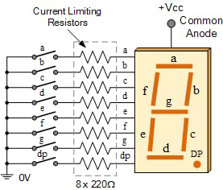

- 8x8 Dot Matrix Display : ແມ່ນຈໍສະແດງຜົນທີ່ປະກອບດ້ວຍໄຟ LED 64 ດອກ ທີ່ຈັດຢູ່ໃນຮູບແບບຕາຂ່າຍ 8 ແຖວ x 8 ຖັນ.
- ໜ້າທີ່ການໃຊ້ງານ : ມັນຍັງໃຊ້ເຕັກນິກ **Multiplexing** ເພື່ອຄວບຄຸມ LED 64 ດອກດ້ວຍຈໍານວນ Pin ທີ່ຈຳກັດ (ເຊັ່ນ: 16 Pin). ແຕ່ລະຈຸດ (Dot) ຖືກຄວບຄຸມໂດຍການສົ່ງສັນຍານໄປຫາແຖວ ແລະ ຖັນທີ່ກົງກັນ.
- ຕົວຢ່າງການນຳໃຊ້ : **ການສະແດງຮູບຫົວໃຈ**.
ຮູບພາບ : 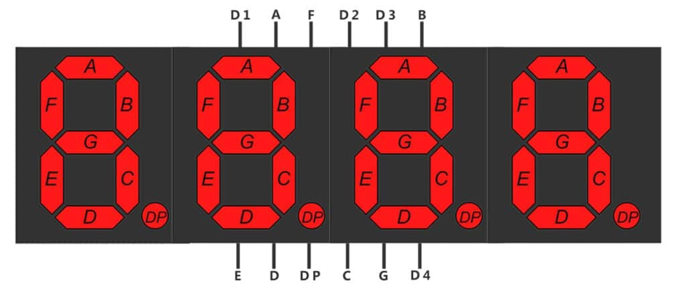

PINOUT Guide : 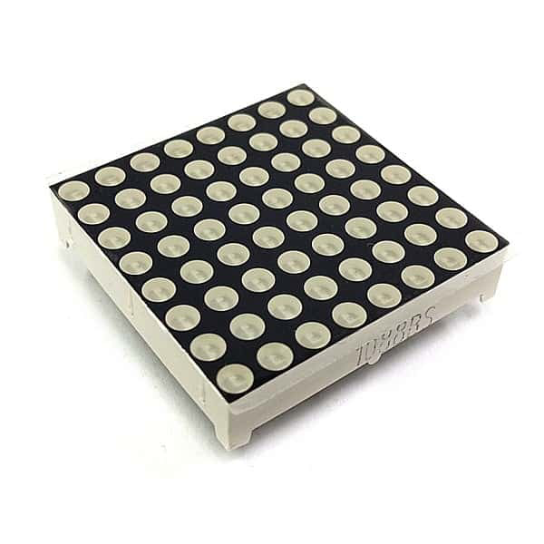

---

## ເຊັນເຊີ ແລະ ໂມດູນປ້ອນເຂົ້າ (Sensors & Input Modules)

- Temperature and humidity sensor (DHT11) : ແມ່ນເຊັນເຊີທີ່ໃຊ້ສຳລັບວັດແທກ **ອຸນຫະພູມ (Temperature)** ແລະ **ຄວາມຊຸ່ມຊື່ນ (Humidity)** ຂອງອາກາດ.
- ໜ້າທີ່ການໃຊ້ງານ : ມັນວັດແທກຄວາມຊຸ່ມຊື່ນໂດຍໃຊ້ສ່ວນປະກອບທີ່ຮັບຮູ້ຄວາມຊຸ່ມຊື່ນ ແລະ ວັດແທກອຸນຫະພູມໂດຍໃຊ້ Thermistor.
-  ຕົວຢ່າງການນຳໃຊ້ : **ການອ່ານຄ່າອຸນຫະພູມ ແລະ ຄວາມຊຸ່ມ**.
ຮູບພາບ : 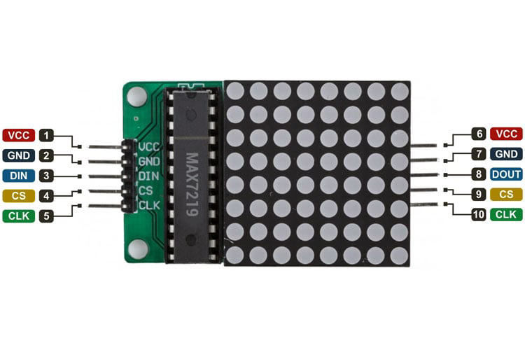

PINOUT Guide : 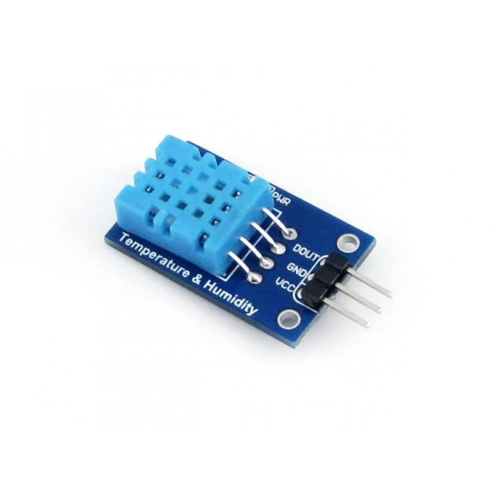

- LM35 Temperature Sensor : ແມ່ນເຊັນເຊີອຸນຫະພູມທີ່ສົ່ງອອກ **ສັນຍານໂວນອະນາລັອກ (Analog Voltage)** ທີ່ເປັນເສັ້ນຊື່ຕາມອຸນຫະພູມໃນອົງສາ Celsius.
- ໜ້າທີ່ການໃຊ້ງານ : ມັນຜະລິດໂວນສົ່ງອອກ $10mV$ ຕໍ່ 1 ອົງສາ ຕົວຢ່າງ: ຖ້າອຸນຫະພູມແມ່ນ $25^\circ C$, ໂວນສົ່ງອອກຈະແມ່ນ $250mV$ ($0.25V$). Arduino ອ່ານໂວນນີ້ຜ່ານ Pin ອະນາລັອກ ແລະ ປ່ຽນມັນເປັນອຸນຫະພູມທີ່ແທ້ຈິງໃນລະຫັດ130.
- ຕົວຢ່າງການນຳໃຊ້ : **ການວັດແທກອຸນຫະພູມຫ້ອງ**.
ຮູບພາບ :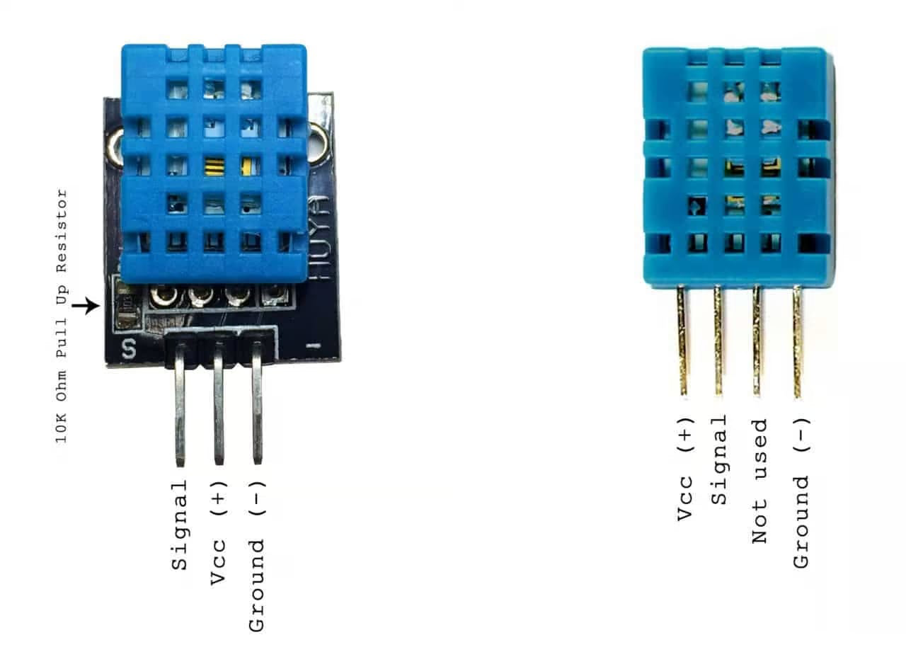

- Tilt Sensor (x2) : ແມ່ນສະວິດທີ່ໃຊ້ວັດຖຸໂລຫະທີ່ເຄື່ອນທີ່ໄດ້ (ເຊັ່ນ: ລູກປັດ) ຢູ່ພາຍໃນເພື່ອກວດພົບການປ່ຽນແປງຂອງມຸມ ຫຼື ຄວາມອຽງ.
- ໜ້າທີ່ການໃຊ້ງານ : ເມື່ອເຊັນເຊີຖືກອຽງໄປໃນມຸມທີ່ແນ່ນອນ, ວັດຖຸໂລຫະພາຍໃນຈະຕິດຕໍ່ກັບສອງຂົ້ວໄຟຟ້າ, ປິດວົງຈອນ. ມັນເຮັດໜ້າທີ່ຄືກັບສະວິດດິຈິຕອລ: ເປັນ **ON** ເມື່ອອຽງ ແລະ **OFF** ເມື່ອຢູ່ໃນສະຖານະອື່ນ.
- ຕົວຢ່າງການນຳໃຊ້ : **ການເຮັດໃຫ້ LED ຕິດເມື່ອເຊັນເຊີຖືກອຽງ**.
ຮູບພາບ : 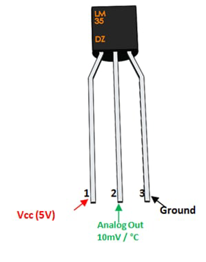
PINOUT Guide : 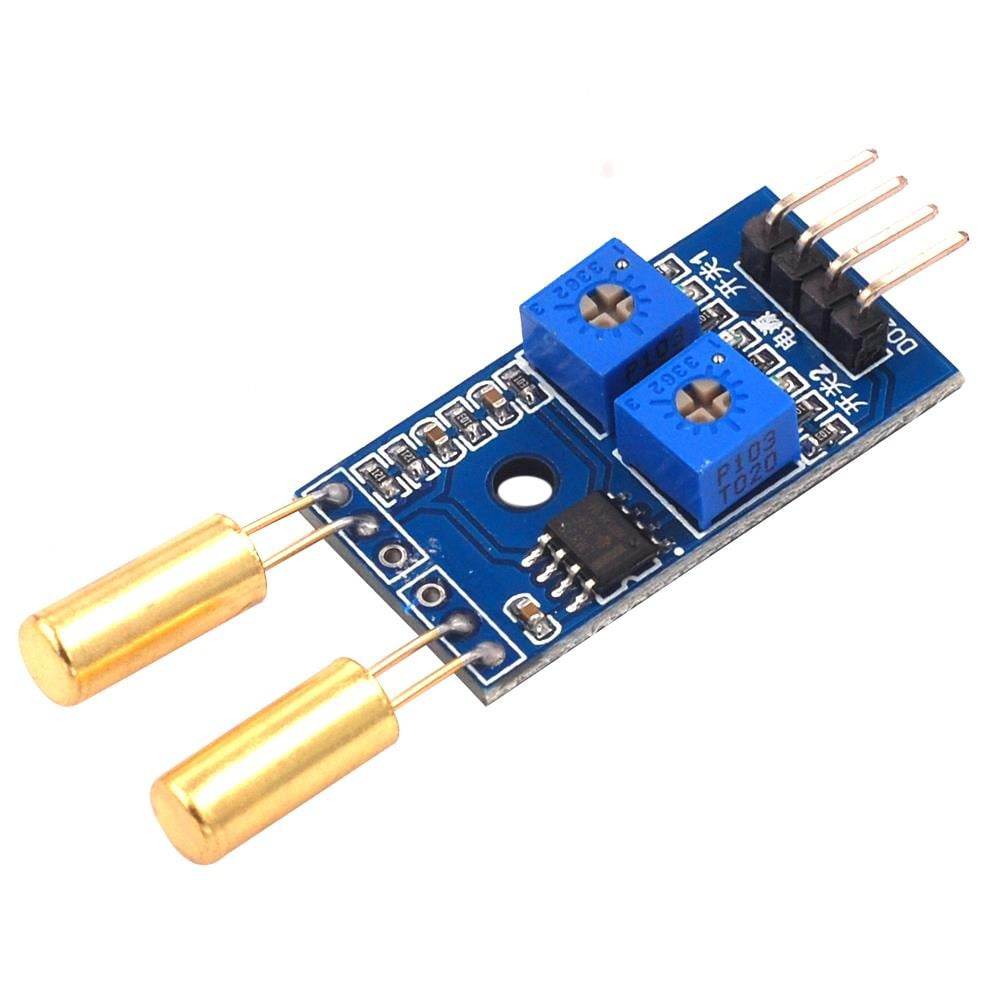

- Photoresistor (LDRs x3) : ແມ່ນ Resistor ທີ່ຄ່າຄວາມຕ້ານທານປ່ຽນແປງໄປຕາມຄວາມເຂັ້ມຂອງແສງທີ່ຕົກໃສ່ມັນ.
- ໜ້າທີ່ການໃຊ້ງານ :ເມື່ອແສງສະຫວ່າງເພີ່ມຂຶ້ນ, ຄວາມຕ້ານທານຂອງ LDR ຈະ **ຫຼຸດລົງ**. ໃນຄວາມມືດ, ຄວາມຕ້ານທານຈະ **ສູງສຸດ**. ມັນຖືກໃຊ້ໃນວົງຈອນ Voltage Divider ຮ່ວມກັບ Resistor ຄ່າຄົງທີ່ (ເຊັ່ນ: 10kΩ) ເພື່ອປ່ຽນຄວາມເຂັ້ມແສງໃຫ້ເປັນຄ່າໂວນອະນາລັອກທີ່ Arduino ສາມາດອ່ານໄດ້.
- ຕົວຢ່າງການນຳໃຊ້ : **ໄຟເປີດ-ປິດອັດຕະໂນມັດ**.
ຮູບພາບ :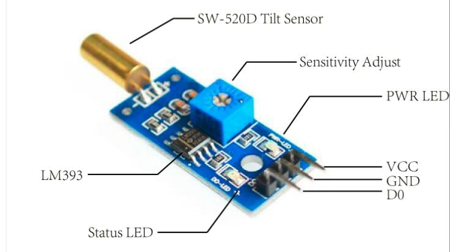

- PIR sensor : ແມ່ນເຊັນເຊີທີ່ໃຊ້ສຳລັບກວດພົບການເຄື່ອນໄຫວຂອງມະນຸດ ຫຼື ສັດໃຫຍ່ໂດຍການວັດແທກການປ່ຽນແປງຂອງລະດັບລັງສີອິນຟຣາເຣດທີ່ປ່ອຍອອກມາຈາກສິ່ງມີຊີວິດ.
- ໜ້າທີ່ການໃຊ້ງານ : ເມື່ອມີຄົນ ຫຼື ສັດ ເຄື່ອນທີ່ຜ່ານໜ້າເຊັນເຊີ, ມັນຈະກວດຈັບການປ່ຽນແປງຂອງລັງສີອິນຟາເຣດ.
- ຕົວຢ່າງການນຳໃຊ້ : **ການສ້າງລະບົບເຕືອນການບຸກລຸກ**.
ຮູບພາບ :!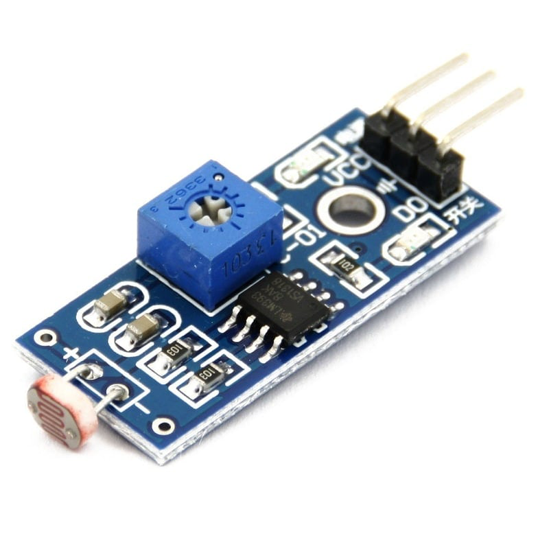
PINOUT Guide :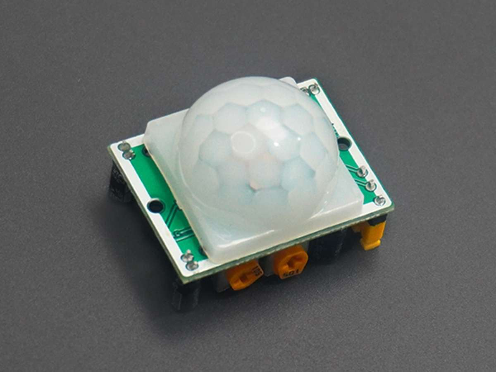

- Ultrasonic module : ແມ່ນເຊັນເຊີໄລຍະຫ່າງທີ່ໃຊ້ຄື້ນສຽງຄວາມຖີ່ສູງ (ultrasound) ເພື່ອວັດແທກໄລຍະຫ່າງເຖິງວັດຖຸ.
- ໜ້າທີ່ການໃຊ້ງານ : ໃຊ້ທົ່ວໄປໃນຫຸ່ນຍົນສໍາລັບການກວດຈັບອຸປະສັກ ຫຼື ການນໍາໃຊ້ການວັດແທກໄລຍະທາງ.
- ຕົວຢ່າງການນຳໃຊ້ : **ການສ້າງເຊັນເຊີຖອຍຫຼັງສຳລັບລົດຫຸ່ນຍົນ**.
ຮູບພາບ : 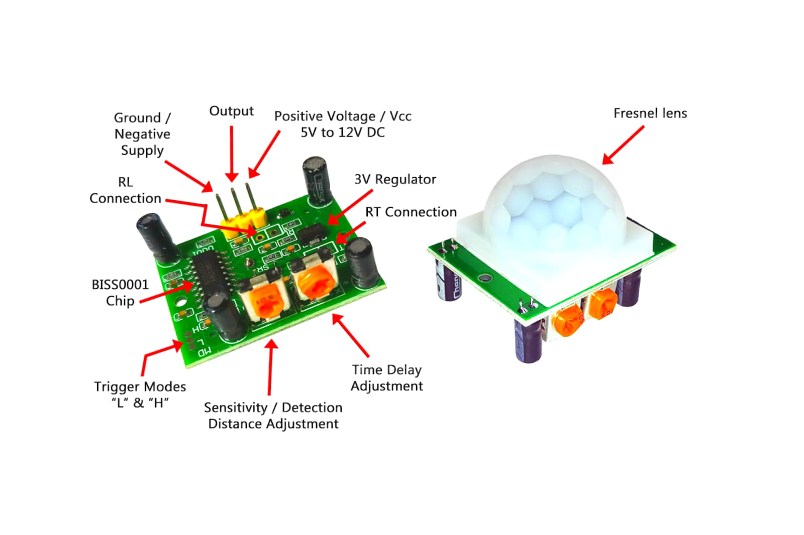  
PINOUT Guide : 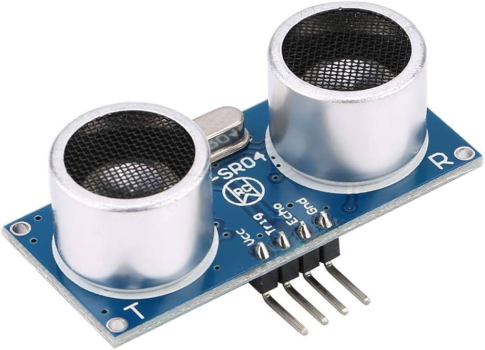

- Sound sensor : ແມ່ນໂມດູນທີ່ໃຊ້ໄມໂຄຣໂຟນ (microphone) ເພື່ອກວດພົບຄວາມເຂັ້ມຂອງສຽງໃນສະພາບແວດລ້ອມ.
- ໜ້າທີ່ການໃຊ້ງານ : ໂມດູນນີ້ເຮັດວຽກໂດຍການແປງຄື້ນສຽງ (ທີ່ເປັນພະລັງງານກົນຈັກ) ໄປເປັນສັນຍານໄຟຟ້າ ໄມໂຄຣໂຟນຮັບຄື້ນສຽງທີ່ມາກະທົບ ແລະ ແປງເປັນສັນຍານໄຟຟ້າ (Analog) ທີ່ປ່ຽນແປງໄປຕາມຄວາມດັງຂອງສຽງ.
- ຕົວຢ່າງການນຳໃຊ້ : **ການສ້າງສະວິດທີ່ຄວບຄຸມດ້ວຍການຕົບມື**.
ຮູບພາບ : 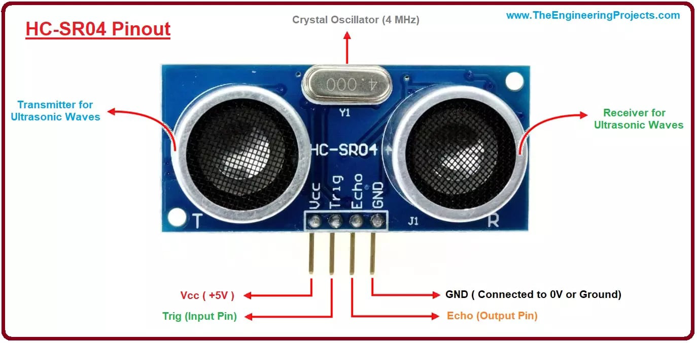
PINOUT Guide : 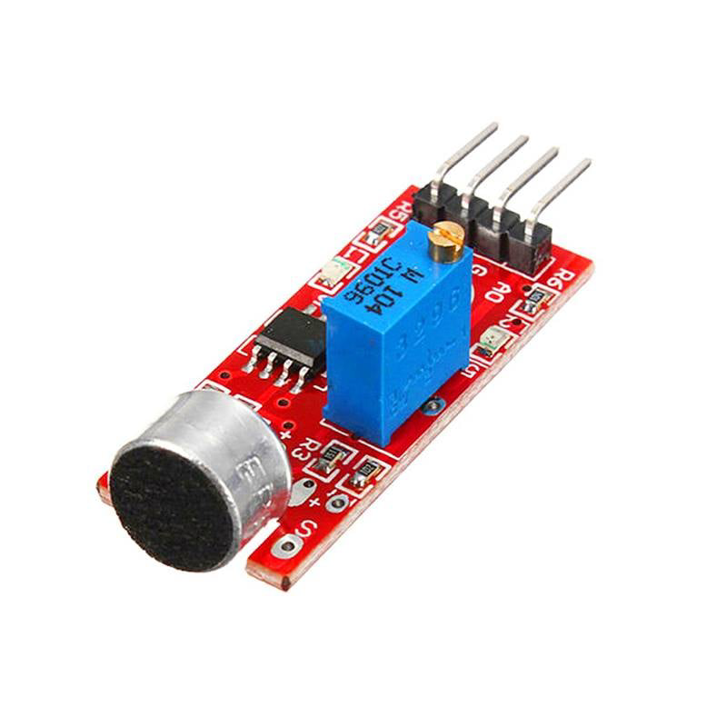

- Water sensor : ແມ່ນເຊັນເຊີທີ່ຖືກອອກແບບມາເພື່ອກວດຈັບການມີຢູ່ຂອງນ້ຳ, ລະດັບນ້ຳ, ຫຼື ກວດຈັບນ້ຳຝົນ.
- ໜ້າທີ່ການໃຊ້ງານ : ມັນສົ່ງ Output ອະນາລັອກທີ່ປ່ຽນແປງຕາມປະລິມານຂອງແຖບທີ່ສໍາຜັດກັບນ້ຳ, ເຊິ່ງ Arduino ສາມາດອ່ານໄດ້.
- ຕົວຢ່າງການນຳໃຊ້ : ໂຄງການ "ເຄື່ອງເຕືອນໄພນ້ຳຮົ່ວ".
ຮູບພາບ : 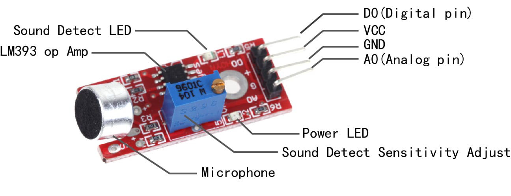
PINOUT Guide : 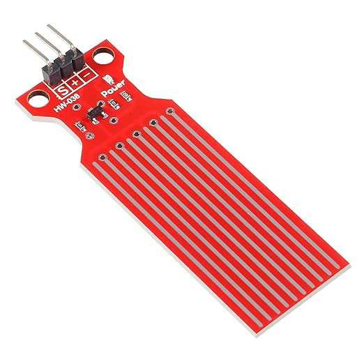
 
- Flame sensor : ແມ່ນເຊັນເຊີທີ່ອອກແບບມາເພື່ອກວດພົບຄື້ນແສງອິນຟຣາເຣດ (IR) ທີ່ປ່ອຍອອກມາຈາກໄຟ.
- ໜ້າທີ່ການໃຊ້ງານ : ຕົວເຊັນເຊີຫຼັກຈະກວດຈັບລັງສີອິນຟຣາເຣດ.
- ຕົວຢ່າງການນຳໃຊ້ : ລະບົບເຕືອນໄພອັກຄີໄພ.
ຮູບພາບ : 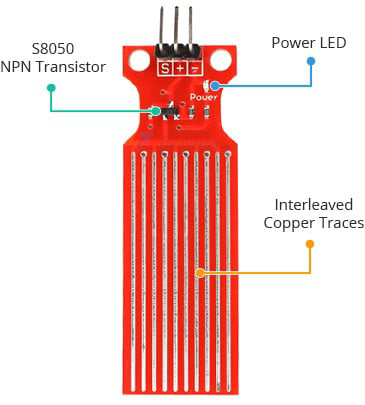
PINOUT Guide : 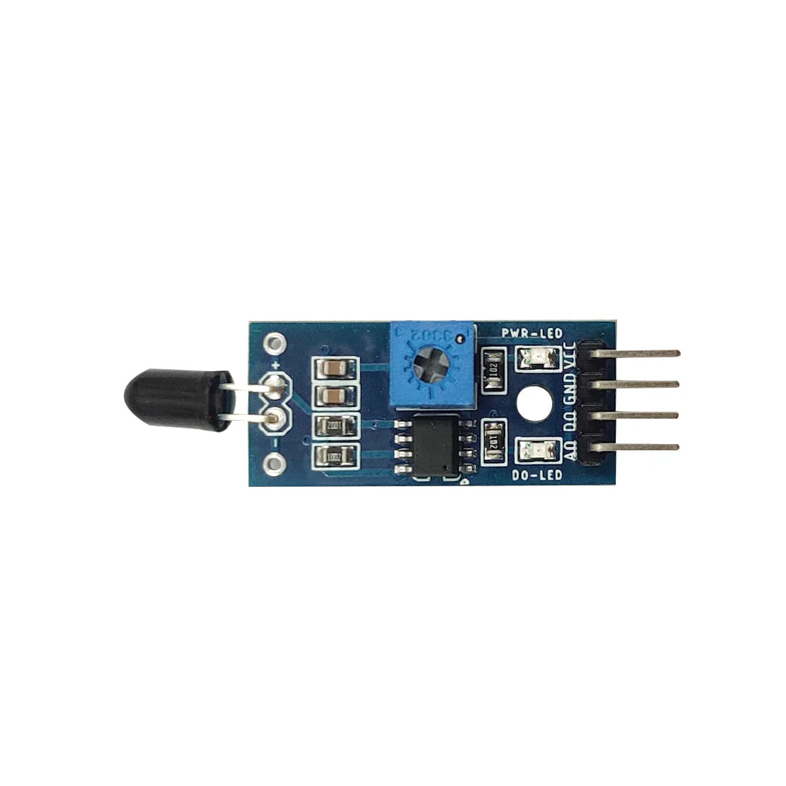

- RFID module : ແມ່ນອຸປະກອນທີ່ອະນຸຍາດໃຫ້ Arduino ສາມາດອ່ານ ແລະ ຂຽນຂໍ້ມູນໄປຫາ RFID Tags (ເຊັ່ນ: key fobs ຫຼື cards). RFID ຫຍໍ້ມາຈາກ **Radio-Frequency Identification**.
- ໜ້າທີ່ການໃຊ້ງານ : ເມື່ອ Tag ເຂົ້າສູ່ສະໜາມນີ້, Tag ຈະໄດ້ຮັບພະລັງງານ ແລະ ສົ່ງຂໍ້ມູນທີ່ເປັນເອກະລັກຂອງມັນກັບຄືນໄປຫາໂມດູນ. ໂມດູນສື່ສານກັບ Arduino ໂດຍໃຊ້ໂປຣໂຕຄໍ SPI.
- ຕົວຢ່າງການນຳໃຊ້ : ລະບົບຄວບຄຸມການເຂົ້າ-ອອກປະຕູ.
ຮູບພາບ : 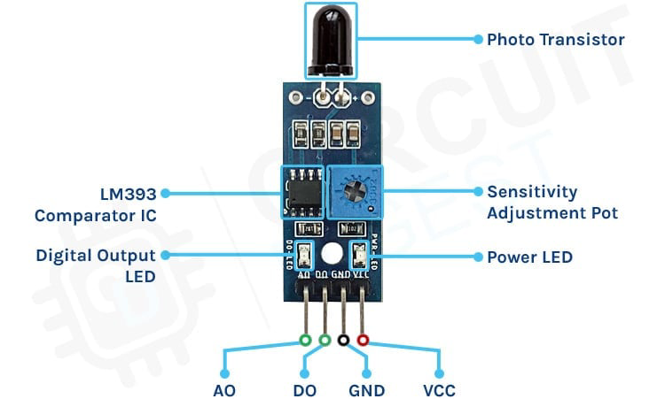
PINOUT Guide : 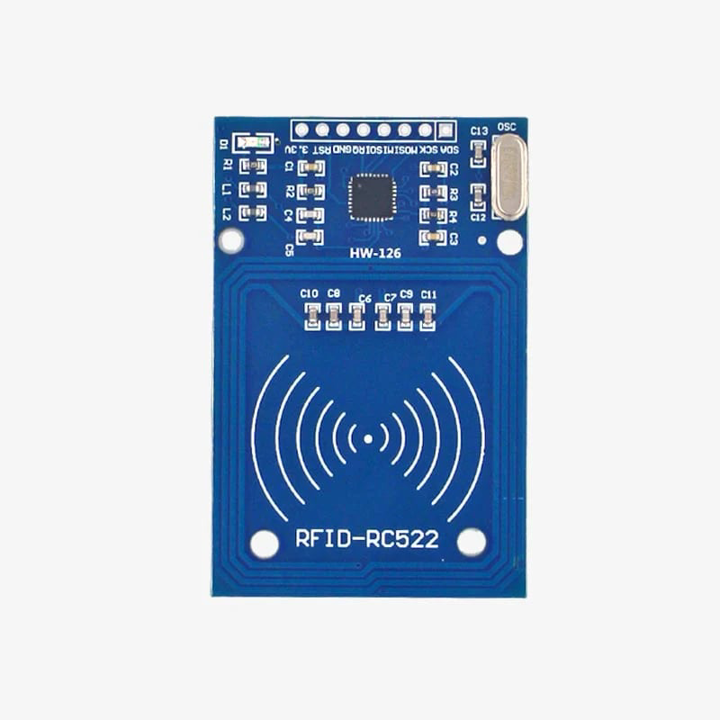

- RFID tag : ເປັນອຸປະກອນຂະໜາດນ້ອຍທີ່ໃຊ້ເກັບຂໍ້ມູນ ແລະ ສົ່ງຂໍ້ມູນນັ້ນໄປຫາຕົວອ່ານໂດຍໃຊ້ຄື້ນວິທະຍຸ.
- ໜ້າທີ່ການໃຊ້ງານ : Tag ນີ້ຈະບໍ່ເຮັດວຽກຫຍັງເລີຍຈົນກວ່າມັນຈະເຂົ້າໄປໃກ້ສະໜາມແມ່ເຫຼັກທີ່ສ້າງຂຶ້ນໂດຍ RFID Reader.
- ຕົວຢ່າງການນຳໃຊ້ : ໃຊ້ເປັນບັດປະຈຳຕົວສຳລັບລະບົບຮັກສາຄວາມປອດໄພ, ອະນຸຍາດໃຫ້ບຸກຄະລາກອນທີ່ໄດ້ຮັບອະນຸຍາດເຂົ້າໂດຍການສະແກນແທັກ RFID.
ຮູບພາບ : 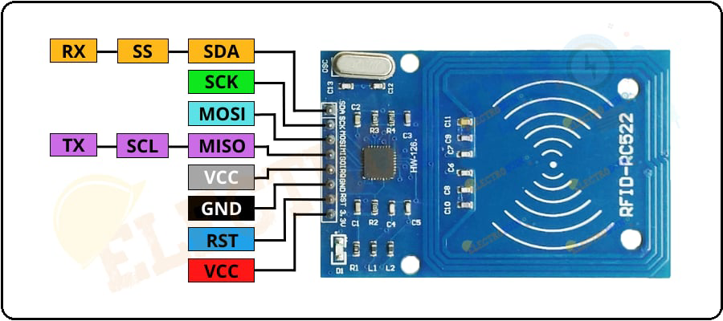

- Infrared receiver : ແມ່ນຕົວຮັບສັນຍານອິນຟຣາເຣດ (IR Receiver) ເປັນເຊັນເຊີອີເລັກໂທຣນິກທີ່ໃຊ້ເພື່ອກວດຈັບ ແລະ ຖອດລະຫັດສັນຍານແສງອິນຟຣາເຣດ ທີ່ຖືກສົ່ງມາຈາກຣີໂໝດຄວບຄຸມ.
- ໜ້າທີ່ການໃຊ້ງານ : ມັນແປງສັນຍານ IR ທີ່ໄດ້ຮັບໃຫ້ເປັນສັນຍານດິຈິຕອລທີ່ Arduino ສາມາດຖອດລະຫັດໄດ້ເພື່ອລະບຸປຸ່ມໃດທີ່ຖືກກົດ.
- ຕົວຢ່າງການນຳໃຊ້ : ຄວບຄຸມໄຟ LED ດ້ວຍຣີໂໝດ TV.
ຮູບພາບ : 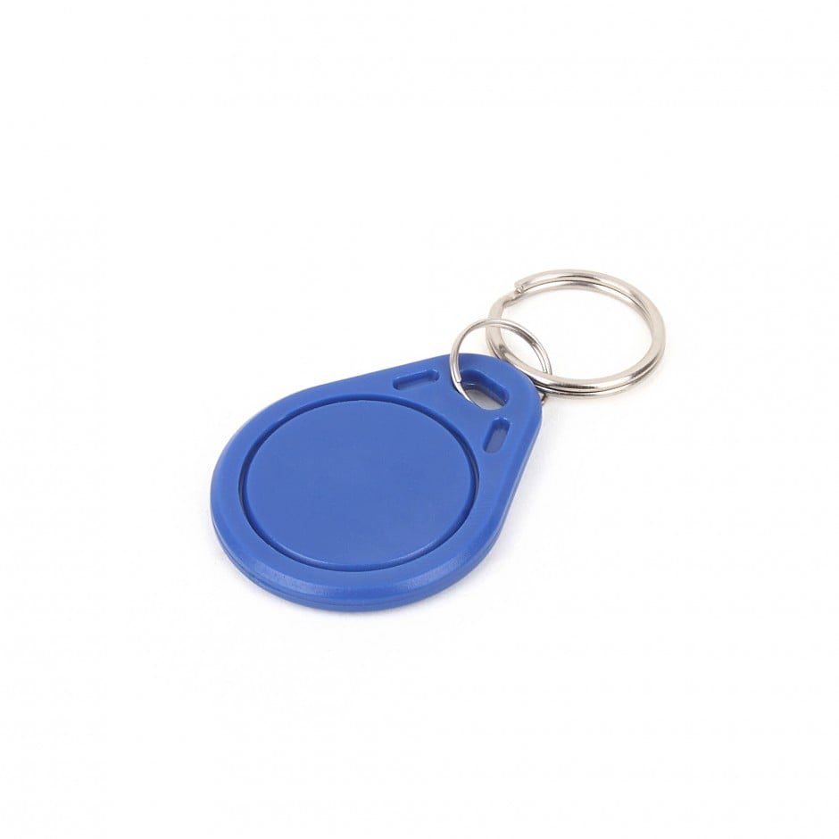
PINOUT Guide : 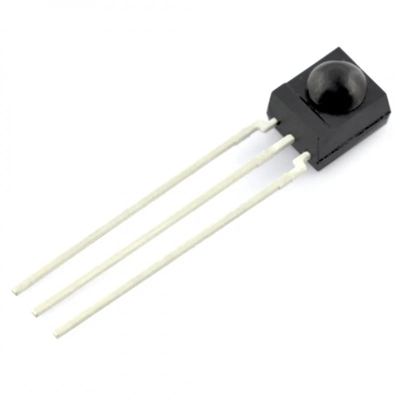

---

## ຣີໂມດ ແລະ ການຄວບຄຸມ (Remote & Control)

- Infrared remote control : ເປັນອຸປະກອນສົ່ງສັນຍານແບບມືຖື ທີ່ໃຊ້ແສງອິນຟຣາເຣດ (IR) ເພື່ອສົ່ງຄຳສັ່ງແບບໄຮ້ສາຍ ໄປຍັງອຸປະກອນອື່ນ (ຄືກັບຣີໂໝດໂທລະພາບ ຫຼື ຣີໂໝດເຄື່ອງປັບອາກາດ).
- ໜ້າທີ່ການໃຊ້ງານ : ເມື່ອຜູ້ໃຊ້ກົດປຸ່ມໃດໜຶ່ງ, ຣີໂໝດຈະສ້າງລະຫັດຄຳສັ່ງ (Code) ທີ່ສະເພາະເຈາະຈົງສຳລັບປຸ່ມນັ້ນ. ຈາກນັ້ນ, ມັນຈະສົ່ງລະຫັດນີ້ອອກໄປຜ່ານຫຼອດໄຟ LED ອິນຟຣາເຣດ (ທີ່ຢູ່ດ້ານໜ້າຂອງຣີໂໝດ) ໂດຍການກະພິບເປັນຮູບແບບສະເພາະ.
- ຕົວຢ່າງການນຳໃຊ້ : **ການຄວບຄຸມລະດັບສຽງຂອງ Passive Buzzer ຈາກໄລຍະໄກ**.
ຮູບພາບ : 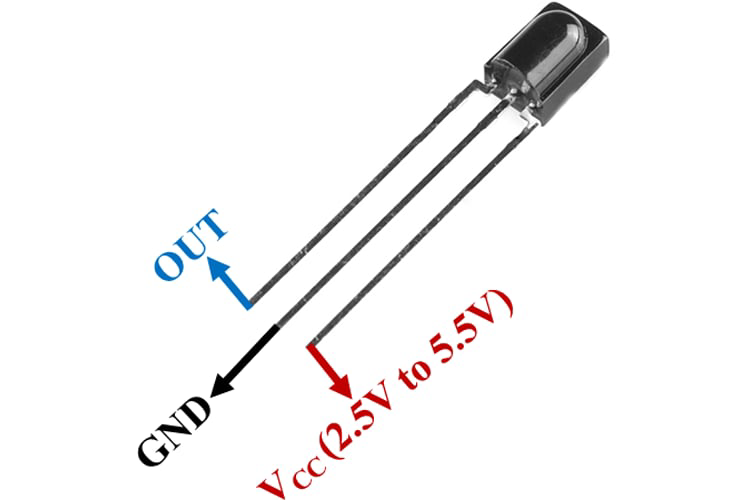

- Joystick module : ປັນອຸປະກອນຮັບຄຳສັ່ງ (Input) ທີ່ຄ້າຍຄືກັບຄັນໂຍກຂອງເຄື່ອງຫຼິ້ນເກມ. ມັນສາມາດກວດຈັບການເຄື່ອນໄຫວໄດ້ 2 ແກນ (ແກນ X: ຊ້າຍ-ຂວາ, ແລະ ແກນ Y: ໜ້າ-ຫຼັງ) ແລະ ມີປຸ່ມກົດອີກ 1 ປຸ່ມ (ເມື່ອກົດຄັນໂຍກລົງ).
- ໜ້າທີ່ການໃຊ້ງານ : ມັນໃຊ້ Potentiometer ຈຳນວນ 2 ຕົວ ເພື່ອວັດແທກຕຳແໜ່ງ ຕົວໜຶ່ງວັດແທກການເຄື່ອນທີ່ໃນແກນ X ແລະ ອີກຕົວໜຶ່ງວັດແທກການເຄື່ອນທີ່ໃນແກນ Y.
- ຕົວຢ່າງການນຳໃຊ້ :ໃຊ້ຄວບຄຸມການເຄື່ອນທີ່ຂອງ Servo motor ໂຍກຈອຍສະຕິກໄປທາງຊ້າຍ ເພື່ອໝຸນເຊີໂວໄປທາງຊ້າຍ, ໂຍກໄປທາງຂວາ ເພື່ອໝຸນໄປທາງຂວາ.
ຮູບພາບ :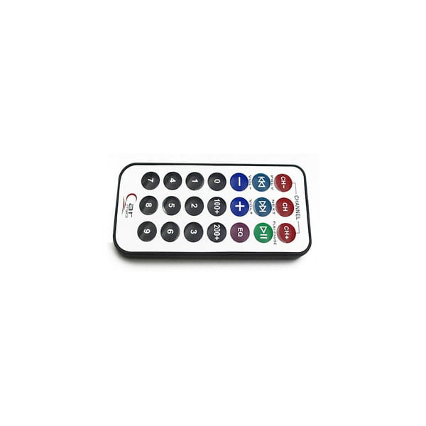
PINOUT Guide :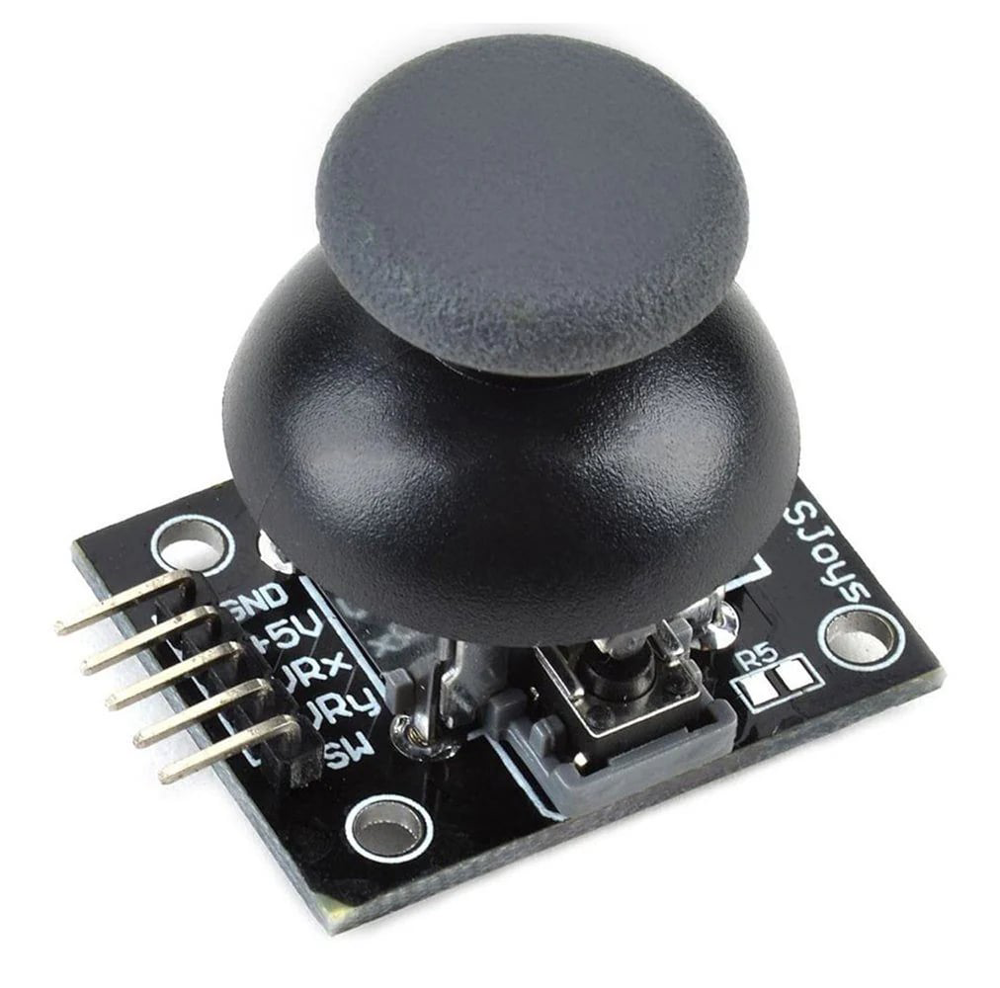

- 4x4 Matrix Keyboard Module : ແມ່ນແປ້ນພິມຂະໜາດນ້ອຍທີ່ມີ 16 ປຸ່ມ (4 ແຖວ ແລະ 4 ຖັນ).
- ໜ້າທີ່ການໃຊ້ງານ : ມັນໃຊ້ວິທີການທີ່ເອີ້ນວ່າ "Matrix Scanning" ເພື່ອປະຢັດຂາ Pin ຂອງ Arduino. ແທນທີ່ຈະຕ້ອງໃຊ້ 16 ຂາ ສຳລັບ 16 ປຸ່ມ, ມັນໃຊ້ພຽງ 8 ຂາ (4 ຂາສຳລັບແຖວ ແລະ 4 ຂາສຳລັບຖັນ).
- ຕົວຢ່າງການນຳໃຊ້ : ໃຊ້ສ້າງລະບົບໃສ່ລະຫັດຜ່ານ. ຜູ້ໃຊ້ຕ້ອງກົດລະຫັດ 4 ຕົວ (ເຊັ່ນ: '1234') ໃຫ້ຖືກຕ້ອງກ່ອນ Arduino ຈຶ່ງຈະສັ່ງເປີດໄຟ LED ສີຂຽວ. ຖ້າກົດຜິດ, ໃຫ້ເປີດໄຟ LED ສີແດງ.
ຮູບພາບ :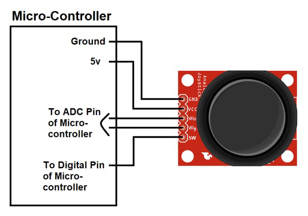

- Relay module :ແມ່ນສະວິດ (Switch) ທີ່ຄວບຄຸມດ້ວຍໄຟຟ້າ. ມັນເຮັດໜ້າທີ່ເປັນ "ຂົວຕໍ່" ທີ່ປອດໄພ, ຊ່ວຍໃຫ້ວົງຈອນທີ່ໃຊ້ໄຟຕ່ຳ (ເຊັ່ນ: Arduino 5V) ສາມາດຄວບຄຸມການເປີດ-ປິດ ອຸປະກອນທີ່ໃຊ້ໄຟສູງ (ເຊັ່ນ: ຫຼອດໄຟບ້ານ 220V ຫຼື ພັດລົມ) ໄດ້ ໂດຍທີ່ວົງຈອນທັງສອງບໍ່ເຊື່ອມຕໍ່ກັນໂດຍກົງ.
- ໜ້າທີ່ການໃຊ້ງານ : ເມື່ອ Arduino ສົ່ງສັນຍານ HIGH ໄປຫາໂມດູນ, ມັນຈະເປີດ/ປິດວົງຈອນແມ່ເຫຼັກ (solenoid) ທີ່ເຮັດໃຫ້ສະວິດພາຍໃນປ່ຽນສະຖານະ: Normally Open (NO) ຈະປິດ. Normally Closed (NC)ຈະເປີດ.
- ຕົວຢ່າງການນຳໃຊ້ : **ການເປີດ/ປິດໂຄມໄຟທີ່ໃຊ້ໄຟບ້ານໂດຍໃຊ້ Arduino**.
ຮູບພາບ : 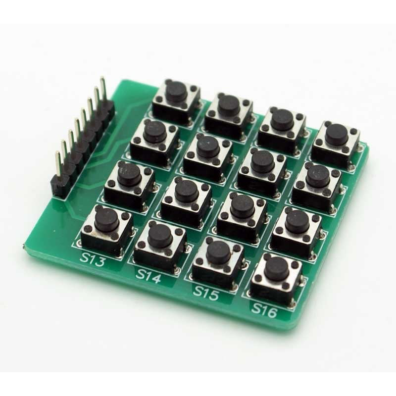
PINOUT Guide : 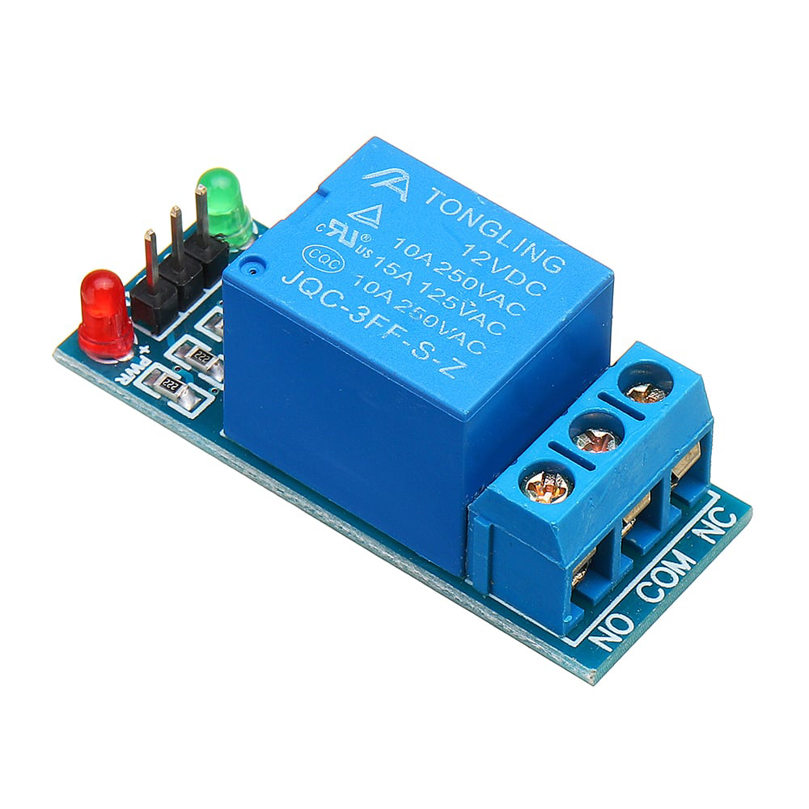

---

## ມໍເຕີ ແລະ ຕົວຂັບ (Motors & Drivers)

- Servo Motor : ເປັນມໍເຕີຊະນິດພິເສດ ທີ່ສາມາດໝຸນໄປຍັງຕຳແໜ່ງ ຫຼື ອົງສາ (Angle) ທີ່ກຳນົດໄວ້ໄດ້ຢ່າງແມ້ນຍຳ (ເຊັ່ນ: 0 ຫາ 180 ອົງສາ) ແລະ ຄ້າງຢູ່ໃນຕຳແໜ່ງນັ້ນ.
- ໜ້າທີ່ການໃຊ້ງານ : ມັນຖືກຄວບຄຸມໂດຍໃຊ້ສັນຍານ **PWM (Pulse Width Modulation)** ຈາກ Arduino. ຄວາມກວ້າງຂອງ Pulse ກໍານົດມຸມທີ່ Shaft ຂອງມໍເຕີຄວນໝູນໄປ.
- ຕົວຢ່າງການນຳໃຊ້ : **ການເປີດ/ປິດປະຕູອັດຕະໂນມັດ**.
ຮູບພາບ : 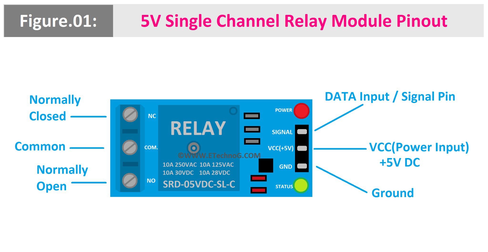
PINOUT Guide : 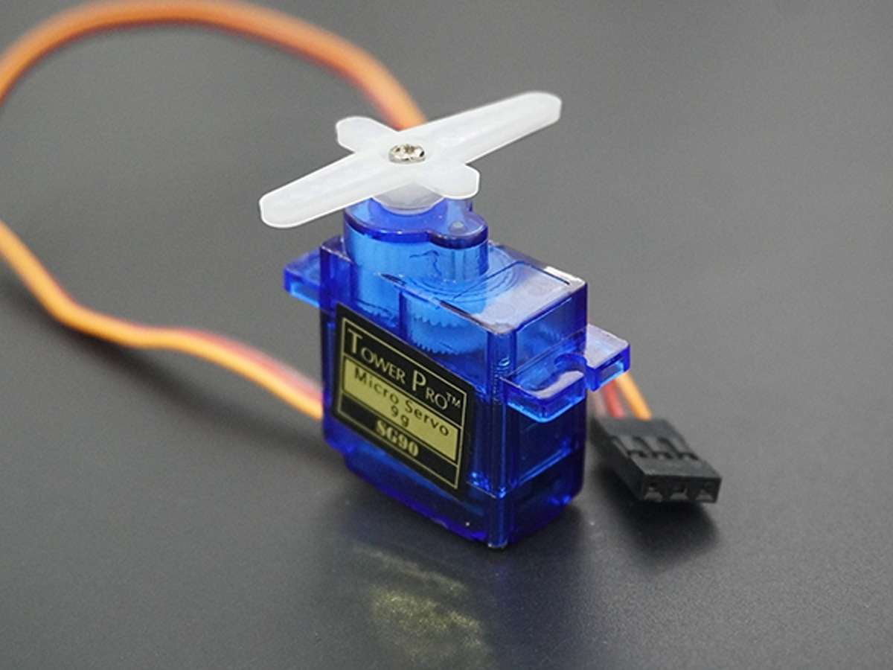

- Stepper Motor : ແມ່ນມໍເຕີ DC ທີ່ໝູນເປັນບາດກ້າວທີ່ຊັດເຈນ (Fixed Increments) ແທນທີ່ຈະໝູນຕໍ່ເນື່ອງ.
- ໜ້າທີ່ການໃຊ້ງານ : ມັນມີຫຼາຍ Coils (ເຊັ່ນ: 4 Coils). ໂດຍການສະໜອງພະລັງງານໃຫ້ກັບ Coils ເຫຼົ່ານີ້ຕາມລໍາດັບທີ່ຖືກຕ້ອງ, ມໍເຕີຈະໝູນໄປເທື່ອລະບາດກ້າວ.
- ຕົວຢ່າງການນຳໃຊ້ : **ການຄວບຄຸມແຂນຫຸ່ນຍົນ ຫຼື ຫົວພິມ 3D**.
ຮູບພາບ : 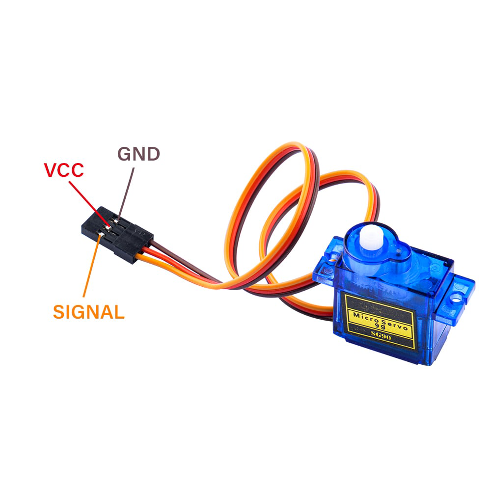
PINOUT Guide : 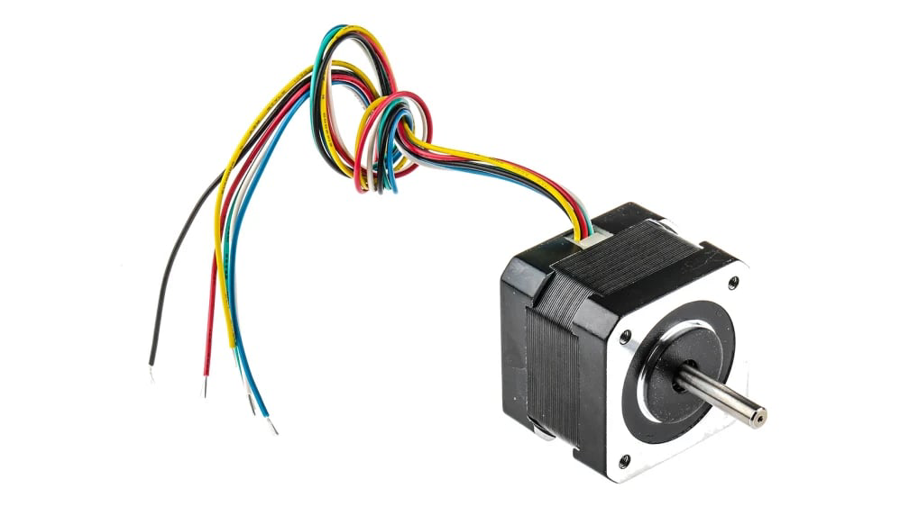

- Stepper Motor driver-board : ແມ່ນແຜງວົງຈອນທີ່ຈຳເປັນສຳລັບການຄວບຄຸມ Stepper Motor.
- ໜ້າທີ່ການໃຊ້ງານ : ມັນເຮັດໜ້າທີ່ເປັນໂຕເຊື່ອມຕໍ່ລະຫວ່າງ Arduino (ສົ່ງສັນຍານໂວນຕ່ຳ) ແລະ Stepper Motor (ຕ້ອງການກະແສໄຟຟ້າສູງ).
- ຕົວຢ່າງການນຳໃຊ້ : **ການໝູນ Stepper Motor ໄປທາງໜ້າ ແລະ ຫຼັງ**.
ຮູບພາບ : 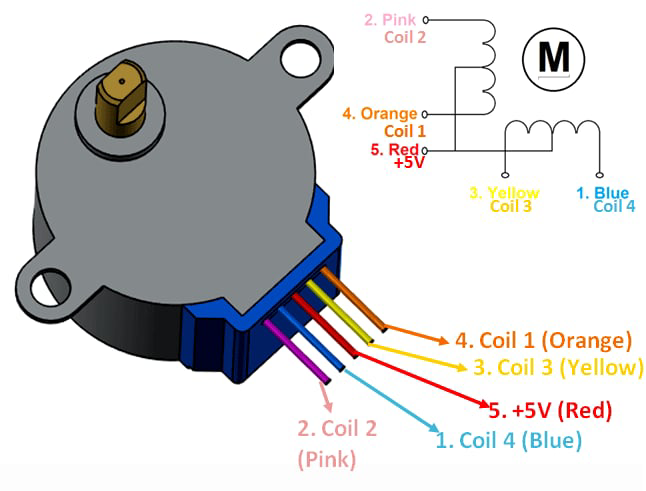

---

## ICs ແລະ ໂມດູນ (ICs & Modules)

- Real-time Clock Module : ເປັນຊິບທີ່ເຮັດໜ້າທີ່ເປັນໂມງ ແລະ ປະຕິທິນ ທີ່ເຮັດວຽກໄດ້ຢ່າງອິດສະຫຼະ. ມັນໃຊ້ເພື່ອຕິດຕາມເວລາຈິງ (ວິນາທີ, ນາທີ, ຊົ່ວໂມງ, ວັນ, ເດືອນ, ປີ).
- ໜ້າທີ່ການໃຊ້ງານ : ໂມດູນມີ Crystal Oscillator ຂອງມັນເອງທີ່ເຮັດໃຫ້ມັນສາມາດນັບເວລາໄດ້ຢ່າງຊັດເຈນໂດຍບໍ່ຕ້ອງເພິ່ງພາໂມງຂອງ Arduino.
- ຕົວຢ່າງການນຳໃຊ້ : **ການສ້າງໂມງທີ່ມີການສະແດງວັນທີ**.
ຮູບພາບ : 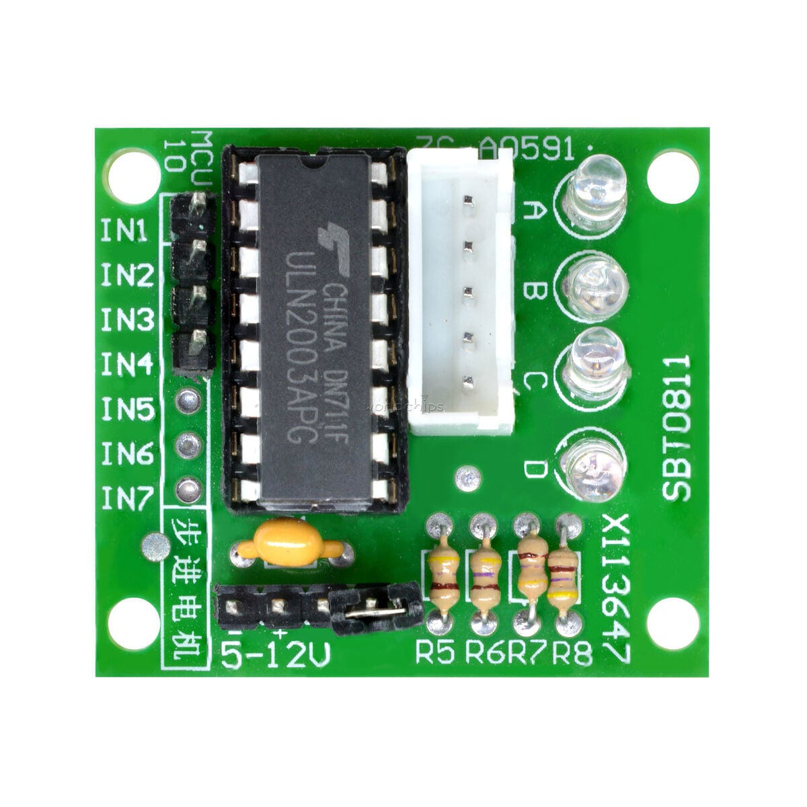
PINOUT Guide : 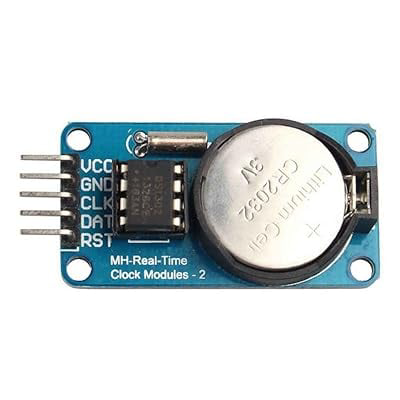

- 74HC595 Chip : ປັນຊິບທີ່ໃຊ້ສຳລັບ "ຂະຫຍາຍ" ຂາ Output ຂອງ Arduino. ມັນຊ່ວຍໃຫ້ເຮົາສາມາດຄວບຄຸມ Output ຈຳນວນຫຼາຍ (ເຊັ່ນ: 8 Output) ໂດຍໃຊ້ຂາຂອງ Arduino ພຽງ 3 ຂາ.
- ໜ້າທີ່ການໃຊ້ງານ : Arduino ສົ່ງຂໍ້ມູນ 8 bits ຢ່າງຕໍ່ເນື່ອງ (Serial) ໄປຫາ Chip, ແລະ Chip ຈະເກັບຂໍ້ມູນນີ້ໄວ້ ແລະ ປ່ອຍມັນອອກມາພ້ອມກັນ (Parallel).
- ຕົວຢ່າງການນຳໃຊ້ : **ການຄວບຄຸມໄຟ LED 8 ດອກໂດຍໃຊ້ພຽງ 3 Pin ຂອງ Arduino**.
ຮູບພາບ :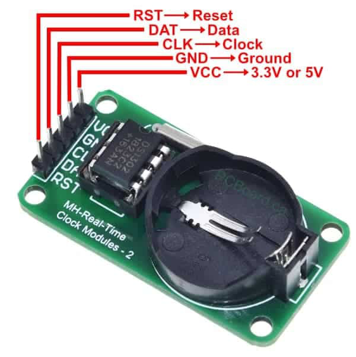

[^1]: 
